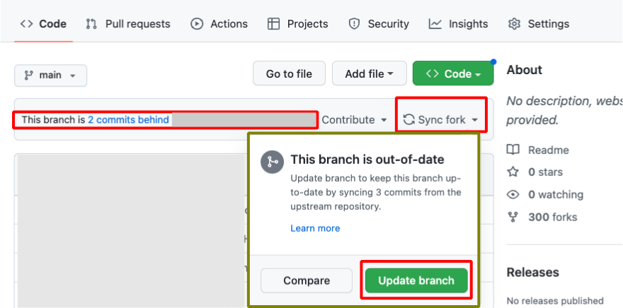

## Building Options

*LoopFollow* can be built using either the Browser Build or the Mac-Xcode Build method.  A paid Apple Developer account is required to use the Browser Build method.  Regardless of how you build, you can customize your *LoopFollow* app’s name.

* Browser Build: 
    * If you have never built, see [LoopDocs: Browser Build for Other Apps](https://loopkit.github.io/loopdocs/browser/other-apps/) 
    * If you are a repeat builder, then you need a one-time update [Browser Build Update for *LoopFollow* v4.0](#browser-build-update-for-loopfollow-v40)
* Mac-Xcode: [Build *LoopFollow* Script for Mac-Xcode](#build-loopfollow-script-for-mac-xcode)

### Browser Build Update for *LoopFollow* v4.0

!!! important "New Capability with LoopFollow v4.0"
    A new capability was added to LoopFollow regarding remote commands which **requires a one-time update** to your LoopFollow **Identifier**. Browser Build will fail until you take these steps.

It doesn't matter whether the person you follow uses *Loop* or *Trio*. You have to update the Identifiers or the Browser Build will fail.

This requires you to [Sync](#sync-your-loopfollow-fork), [Add Identifiers](#run-add-identifiers), [Create Certificates](#run-create-certificates) and [Build](#run-build-loopfollow):

#### Sync Your *LoopFollow* fork

* Go to your *LoopFollow* fork and click on the Sync button
* If your browser build already failed, it already did the sync for you

> {width="700"}

#### Run `Add Identifiers`

1. Click on the Actions tab of your *LoopFollow* repository
2. On the left side, click on `2. Add Identifiers`
3. On the right side, click Run Workflow to show a dropdown menu
4. Tap the green button that says Run workflow.

> {width="700"}

**Wait for this to complete before you create certificates.**

#### Run `Create Certificates`

1. Click on the Actions tab of your *LoopFollow* repository
2. On the left side, click on `3. Create Certificates`
3. On the right side, click Run Workflow to show a dropdown menu
4. Tap the green button that says Run workflow.

> {width="700"}

**Wait for this to complete before you build *LoopFollow*.**

#### Run `Build LoopFollow`

1. Click on the Actions tab of your *LoopFollow* repository
2. On the left side, click on `4. Build LoopFollow`
3. On the right side, click Run Workflow to show a dropdown menu
4. Tap the green button that says Run workflow.

> {width="700"}

**Once this completes, be sure to update from TestFlight to get the updated version of *LoopFollow* on your phone.**

If you follow two loopers, repeat those steps for LoopFollow_Second. For three loopers, repeat for LoopFollow_Third.


### Build LoopFollow Script for Mac-Xcode

Carefully read the information in the terminal before making any choices.

Step 1: Open Terminal

> Tip: Press Command-Space to open spotlight search. Start typing “term” (without the quotes) and you will see the Terminal application icon in the box. Hit enter to open.

Step 2: Copy the entire line starting with /bin/bash and then Paste the line into Terminal and enter

Click on the copy icon at right of the box below to copy it. You’ll see Copied to Clipboard briefly.

``` { .bash .copy title="Copy and Paste to start the Build LoopFollow Script" }
/bin/bash -c "$(curl -fsSL \
  https://raw.githubusercontent.com/loopandlearn/lnl-scripts/main/BuildLoopFollow.sh)"
```

Step 3: Choose from one of the options presented by the script

> If you are not following multiple Loopers, always choose 1 for the latest release.

You are prompted to enter a custom name if you want or you can continue using the LoopFollow default name

> If you are following up to 3 Loopers, choose option 1, 2 or 3.

* Each Looper can have a unique name displayed for the app
* Each time you download using the script, the name you selected the first time is remembered, but editing instructions are provided

To test a specific feature that is only found in the dev branch, choose option 4. This is not typical, and only builds to the app associated with Looper #1

### Run LoopFollow on Mac using TestFlight

If you used the Browser Build method, follow these instructions to run LoopFollow on your Mac computer using TestFlight. (You can also use an iPad.)

* You need to install the TestFlight app on your computer
* The TestFlight app on the Mac shows the same set of builds and uses the same installation procedure as shown in LoopDocs for installing apps on a phone from TestFlight
* Install on computer from TestFlight
* You need to enter the data source and configuration values into the app on your computer

From Mac system settings/notifications, scroll down to LoopFollow and enable notifications with the options you want.

### Run LoopFollow on your Mac with Mac-Xcode Build

1. Build LoopFollow to your Mac with Xcode (choose My Mac (Mac Catalyst) as the device)
2. Click Stop to close the running app that is started by Xcode
3. On the left side of Xcode, click on the Folder icon
4. Click to open the LoopFollow folder list
5. Click to open the LoopFollow/Products folder
6. Right-click (or Control-click) on “LoopFollow.app” and select Show in Finder
7. First time on the Mac:
    * Drag the LoopFollow.app icon to your Applications folder in Finder
    * From Mac system settings/notifications, scroll down to LoopFollow and enable notifications with the options you want
8. When updating on your Mac
    * Make sure you close the LoopFollow app currently running on your computer
    * Drag the LoopFollow.app icon to your Applications folder in Finder
    * Most people choose to replace the application, but you can keep both if you prefer
    * All configurations and settings are maintained

### Selection of Branch to Build

`main` vs. `dev`

*LoopFollow* users should build *LoopFollow*-main.  New features are tested in the dev branch. Once they are thoroughly tested, they are merged into main.  Experienced users can test *LoopFollow*-dev, but there will be minimal support. Any issues found with *LoopFollow*-dev should be reported in GitHub.   

### Updates

When modifications and versions are updated, you might see activity at GitHub. Please wait for the release message to be posted at [LoopFollow Releases](https://github.com/loopandlearn/LoopFollow/releases) before using the updated versions for the `main` branch of LoopFollow, LoopFollow_Second and LoopFollow_Third.

### Version Numbers

Updates to the `main` branch (releases) have a version number that ends in 0; for example, 3.1.0.

* Immediately following the release, the `dev` branch is at the same version as `main` indicating the code is identical
* Each time a feature is merged into the `dev` branch, the final number increments; for example, 3.1.1, 3.1.2
* When the next release is made, the second digit is incremented and the final digit is restore to 0 for both `main` and `dev`; for example, 3.2.0

