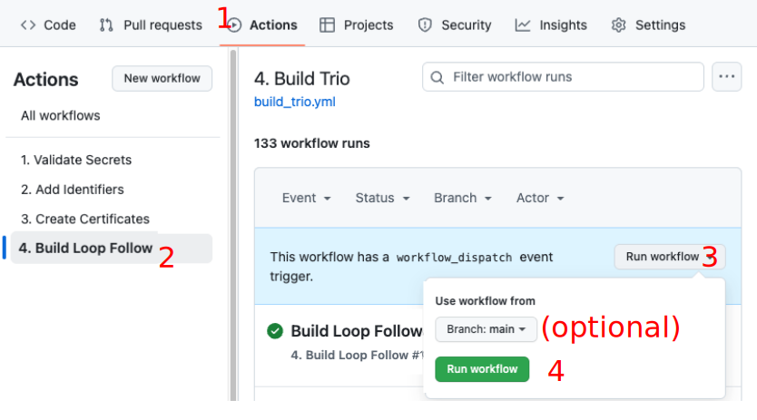

## Overview

**This page is for users who have configured an organization with their build credentials.**

* If you don't know what that means, please review the entire Browser Build section in LoopDocs starting with [Browser Build Overview](https://loopkit.github.io/loopdocs/browser/bb-overview)

### Multiple Copies of `LoopFollow`

For the convenience of caregivers who follow more than one person, you can build up to three instances of `LoopFollow`.

### Customize `LoopFollow`

If you choose, you can:

* Customize the name of the app that appears on your phone
* Display the custom name in the main `LoopFollow` screen

### Prerequisites

* This page is only for users who have built using Browser Build method before and who have configured an organization that already contains their Secrets.

- - -

## Summary of Steps to Build *LoopFollow*

Detailed directions are found in the next sections, this is the summary of what you will do:

1. Click on the link to open the repository in your browser
2. `Fork` the repository to your organization
3. Open your `fork` and enable Actions
4. `Add Identifiers`
6. Add the App in App Store Connect and configure TestFlight users
7. `Build LoopFollow`

!!! tips "What About Other Actions"
    * You already have your organizaton configured, there is no need to run `Validate Secrets`
    * The Build action includes a `Create Certificates` step - you can run it separately but it is not necessary

### Fork LoopFollow

You start by opening a browser using the URL from the table below. Most people only need the *LoopFollow* app to follow one person. If you need to follow more than one person, then repeat the steps for each of the URL in the table. If you need to follow more than three people, reach out to the developers for help.

* Click on the link to open the repository in your browser
* Follow the directions to [Create the Fork](#create-the-fork)

### Table of App `Repositories`

| App | Fork from this Address | 
|---|---|
| LoopFollow | [https://github.com/loopandlearn/LoopFollow](https://github.com/loopandlearn/LoopFollow) |
| LoopFollow_Second | [https://github.com/loopandlearn/LoopFollow_Second](https://github.com/loopandlearn/LoopFollow_Second) |
| LoopFollow_Third | [https://github.com/loopandlearn/LoopFollow_Third](https://github.com/loopandlearn/LoopFollow_Third) | 

??? tips "LoopFollow Display Name Customization (Click to Open/Close)"
    * Would you like the name of your LoopFollow app to be personalized?
    * Do you have more than one Looper, so you are using LoopFollow_Second or LoopFollow_Third?
    * The 3 LoopFollow repositories enable you to customize the name shown on your phone

    After you `fork` your *LoopFollow* repository, find the file named: `LoopFollowDisplayNameConfig.xcconfig`

    * Open it in your browser
    * Follow the directions for [Display Name Customization for `LoopFollow`](#display-name-customization-for-loopfollow){: target="_blank" }
        * "Save the file" means commit the change to your `main` branch
        * It is recommended that you use LF_name, where name is the customized name - that way you can find it in an alphabetic list of apps

### Create the `Fork`

1. At the upper right side of the screen, click on the word `Fork`

    {width="700"}
    {align="center"}

1. Refer to the GIF below:
    * You will see the display shown in the GIF below where you will choose your organization as the owner
        * This GIF is copied from LoopDocs, your screen will show `loopandlearn/LoopFollow` instead of `LoopKit/LoopWorkspace`
    * The repository name is already filled in
        * **It is best not to rename the repository to something else**
        * It can be confusing if you need to reach out to a mentor for help
        * However, if you have 3 people you follow it's fine to use names like:
            * LoopFollow_Mary
            * LoopFollow_Second_Joe
            * LoopFollow_Third_Tom
    * Leave the selection that says "`Copy the main branch only`" checked
    * Click on the green `Create fork` button

    {width="700"}
    {align="center"}

#### Successful Fork

After creating the &nbsp;fork, your screen should be similar to the next graphic.

!!! info "Dismiss Messages"
    You may or may not see the messages described in the next two bullets. If you see them, dismiss them. No worries if you don't see them. They are not seen in the example screenshot below.

    * Near the top right, click on the close button :octicons-x-16: (`x`) to dismiss the `Successfully fetched` message
    * In the middle, click on the `Dismiss` button to remove the "`Your branch is not protected`" message

{width="750"}
{align="center"}

* Note that your URL is `https://github.com/my-name-org/LoopFollow`
* The comment on the second row indicates where the &nbsp;fork&nbsp; came from (that is a clickable link)
* The branch :octicons-git-branch-16: selected is `main`
* The message says "`This branch is up to date with loopandlearn/LoopFollow:main`"

## Add Identifiers

Near the top middle of your Repository fork, click on the "Actions" tab.

* If this is the first `Action` you run with this repository you'll be informed that `Workflows aren't being run on this forked repository`
    * Tap on the green button that says: `I understand my workflows, go ahead and enable them`

Refer to the graphic below for the numbered steps:

1. Click on the "Actions" tab of your repository
1. On the left side, click on "Add Identifiers"
1. On the right side, click "Run Workflow" to show a dropdown menu
    * You will see your default branch (`main`)
    * You can select a different branch, but typically, you run the default
1. Tap the green button that says "Run workflow"

    {width="700"}
    {align="center"}

The `Add Identifier` &nbsp;Action&nbsp; should succeed or fail in a few minutes.

* If you see the green check (:octicons-check-circle-fill-16:{: .passed })  continue to the next section
* If you see the red `X` (:octicons-x-circle-fill-16:{: .failed }):
    * Use the Browser Build Errors page to resolve the error, then repeat the Action
    * [Quick Reference for Browser Build Errors](https://loopkit.github.io/loopdocs/browser/bb-errors/#quick-reference-for-browser-build-errors)

## Review App Identifier

Open this link: [Certificates, Identifiers & Profiles: Identifiers List](https://developer.apple.com/account/resources/identifiers/list){: target="_blank" } on the apple developer site.

After successfully performing the `Add Identifiers Action`, you will see the identifier for your app with a Name and Bundle ID matching that in the table below. You will see your unique TEAMID embedded in the identifier. (If you previously built this App with Xcode, the name may start with XC but the ending should match.)

| App Name | Name | Bundle ID |
| --- | --- | --- |
| LoopFollow | LoopFollow | com.TEAMID.LoopFollow |

> If you build from a second or third `repository` for `LoopFollow`, the Name will end in `Second` or `Third` and Bundle ID will have `.Second` or `.Third` at the end.

- - -

## Create App in App Store Connect

You must create an App in App Store Connect if you don't already have one.

Examine the table below for the bundle ID associated with your app.

| App Name | Bundle ID |
| --- | --- |
| LoopFollow | com.TEAMID.LoopFollow |

> If you build from a second or third `repository` for `LoopFollow`, the Bundle ID will have `.Second` or `.Third` at the end.

1. Open this link: [App Store Connect / Apps](https://appstoreconnect.apple.com/apps) to view your apps; log in if needed.

1. If this App already exists, you can continue to the build step
1. Click the Add Apps button or the blue "plus" icon and select New App as shown in the graphic below

    {width="300"}
    {align="center"}

1. The New App dialog box opens and should appear similar to the graphic below. Before you fill anything out, make sure your Bundle ID is available in the dropdown menu. If you do not see the Bundle ID for your app; you should ask a mentor for help.
    * Select "iOS". For LoopFollow you can also select "macOS" if you own a Mac with macOS 11 or later.
    * Enter a name: this will have to be unique
        * You could start with "App Name ABC" where ABC are your initials
        * If that is already taken, you can add a number, for example, "App Name ABC 123"
        * This name is what you see on the App Store Connect list and in the *TestFlight* app
        * Once installed on your phone, you will see the actual app name
        * You can [Change the App Store Connect Name](https://loopkit.github.io/loopdocs/browser/phone-install/#change-the-app-store-connect-name) later if you want
    * Select your primary language.
    * Choose the bundle ID for your app
    * SKU can be anything; for example "123" but must be unique across all your apps, so try 1234 or 12345 depending on how many apps you build with this method
    * Select "Full Access".

    {width="600"}
    {align="center"}

1. Click Create but do not fill out the next form. That is for submitting to the app store and you will not be doing that.

You are done with the create app step. 

**You will use this same browser location to complete the next step. Tap on the *TestFlight* tab at the top of the page.**

## Add Users to *TestFlight* for App

> If you are not already on your app page because you just created it, use this link to get there: [App Store Connect / Apps](https://appstoreconnect.apple.com/apps). Find your app and click on it and then select the *TestFlight* tab at the top of the page.

You need to configure a *TestFlight* Internal Testing Group for each app you build and invite the users (including yourself).

* Each person added to the Internal Testing Group gets an invitation to join the group for this app
* Then after each successful build of the app, group members will get a notification when the new build is transferred to *TestFlight* and is available for use
* They open the *TestFlight* app on their phone to install the new build

If you need detailed instruction, visit [Configure to Use Browser: *TestFlight* Users Overview](https://loopkit.github.io/loopdocs/browser/tf-users/#testflight-overview).

## Build App

### Display Name Customization for `LoopFollow`

> If you build `LoopFollow` for one, two or three loopers, you may choose to customize your `fork` or `forks` to insert a custom display name.

> * Find and click on the file `LoopFollowDisplayNameConfig.xcconfig`
> * Tap the pencil icon so you can edit the file
> * The last line says `display_name = LoopFollow` (or `LoopFollow_Second` or `LoopFollow_Third`)
> * Insert your custom name so the last line says `display_name = LF custom name`
> * Click on commit changes and chose to commit directly into the `main` branch

> Continue to build as instructed below. After you install the app on your phone, iPad or Mac via *TestFlight*, that custom name is what is displayed. The prefix LF is suggested to make it easier to find the custom named `LoopFollow` app in the list of apps, but is not required.

### Build Action

11. Click on the Actions tab of your *LoopFollow* repository
2. On the left side, click on `4. Build LoopFollow`
3. On the right side, click Run Workflow to show a dropdown menu
4. Tap the green button that says Run workflow.

> {width="700"}

**Once this completes, be sure to update from TestFlight to get the updated version of *LoopFollow* on your phone.**

Repeat the build and install from TestFlight steps if you use LoopFollow_Second or LoopFollow_Third.

> Your app should eventually appear on [App Store Connect](https://appstoreconnect.apple.com/apps).

### Build Errors

Refer to the [Browser Build: Build Errors](https://loopkit.github.io/loopdocs/browser/bb-errors) to find your error.

Please do not remove an existing app if you have trouble building a new one. Your build error is not cause by any existing app.

!!! Important "Removing App Warning"
    If you remove an app and later want to restore that app, you might not be able to.

## Install on Phone

The [LoopDocs instructions: Install on Phone](https://loopkit.github.io/loopdocs/browser/phone-install) walk you through the steps to install the app to a phone. When going through those steps, replace your App Name for&nbsp;_Loop_. Everything else is the same.

!!! success "Adding Push Notifications Simplified with v4.4"
    Provided in *LoopFollow* v4.4 and newer, you can run Add Identifiers to add the required `Push Notifications` capability.
    
    For *LoopFollow* v4.0 through 4.3, you had to manually add that capability to the Identifier. Thanks to our friends at fastlane, who updated their tool, this manual action is no longer necessary.

## Archaic Instructions

Given that a Browser Build must be rebuilt every 90 days, the instructions here are unlikely to be required.

### Update from *LoopFollow* v3.x

When updating from an older version of *LoopFollow*, v3.x or older, you need to add the `Push Notification` to the Identifier Capabilities:

* [Sync Your Fork](#sync-your-fork)
* [Run Add Identifiers](#run-add-identifiers) to add the new capability
* [Build Your App](#build-your-app)

> Repeat these steps if you use LoopFollow_Second or LoopFollow_Third.

#### Sync Your Fork

* Go to your *LoopFollow* fork and click on the Sync button

> {width="700"}

#### Run Add Identifiers

* In your *LoopFollow* fork, select the Action tab and run the Add Identifiers Action
* Wait for a successful completion before trying to Build.

??? abstract "Detailed Instructions to Run Add Identifiers (Click to open/close)"
    Refer to the graphic below for the numbered steps:

    1. Click on the "Actions" tab of your repository
    1. On the left side, click on "Add Identifiers"
    1. On the right side, click "Run Workflow" to show a dropdown menu
        * You will see your default branch (`main`)
        * You can select a different branch, but typically, you run the default
    1. Tap the green button that says "Run workflow"

        {width="700"}
        {align="center"}

    The `Add Identifier` &nbsp;Action&nbsp; should succeed or fail in a few minutes.

    * If you see the green check (:octicons-check-circle-fill-16:{: .passed })  continue to the next section
    * If you see the red `X` (:octicons-x-circle-fill-16:{: .failed }):
        * Use the Browser Build Errors page to resolve the error, then repeat the Action
        * [Quick Reference for Browser Build Errors](https://loopkit.github.io/loopdocs/browser/bb-errors/#quick-reference-for-browser-build-errors)

#### Build Your App

* In your *LoopFollow* fork, select the Action tab and run the Build LoopFollow Action
* Wait for a successful completion and wait for the TestFlight upload (timing varies from a few minutes to a few hours) until trying to install the new build on your phone

??? abstract "Detailed Instructions to Build LoopFollow (Click to open/close)"
    1. Click on the Actions tab of your *LoopFollow* repository
    2. On the left side, click on `4. Build LoopFollow`
    3. On the right side, click Run Workflow to show a dropdown menu
    4. Tap the green button that says Run workflow.

    > {width="700"}

**Once this completes, be sure to update from TestFlight to get the updated version of *LoopFollow* on your phone.**

