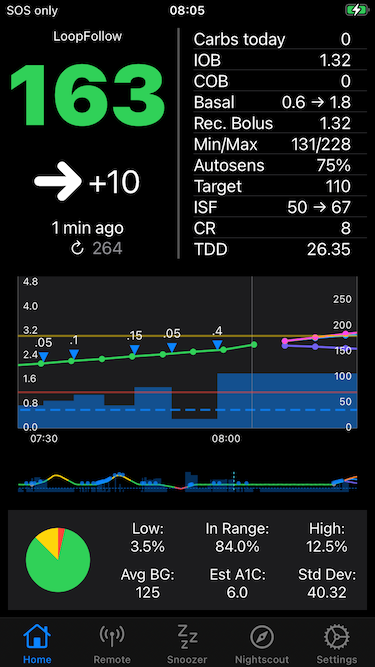

## *LoopFollow* 

*LoopFollow* is an open-source DIY (do-it-yourself) app that displays information for a person with diabetes in an easy-to-use interface. 
It combines information from multiple other apps and provides custom alerts. It runs on iPhone, iPad or Mac devices. With newer versions, some remote control features are available for the *Loop* and *Trio* apps.

*LoopFollow* was created because using different apps as a parent or caregiver of a person with diabetes can be cumbersome. 
Add in the extra details from looping with an Open Source Automated Insulin Delivery (OS AID) app 
and flipping back and forth between various sources of information can be a challenge. 
Many loopers use *LoopFollow* for themselves because of the flexible (and loud) alarm options.

*LoopFollow*:

* Displays information from a Nightscout URL or Dexcom Share account
* Provides flexible alarm features with a Snooze screen
* Supports *Loop* and *Trio* OS AID systems and provides remote control features
* Supports up to 3 loopers – each with their own unique app name
* Works with your Apple Watch
* Runs on an iPhone, iPad or a Mac computer

An example of the main screen for *LoopFollow* is shown in the graphic below:

> 
{align="center"}

- - -

## Hardware Requirements

The *LoopFollow* app will run on any iPhone or iPad that supports iOS 16.6 or newer operating system and on any Mac computer with an Apple Silicon chip, i.e., M1, M2, M3, M4, etc.

- - -

## Build Options

*LoopFollow* can be built with a [Browser on any computer](build/build-options.md#building-options){: target="_blank" } or using [Xcode on a Mac](build/build-options.md#build-loopfollow-script-for-mac-xcode){: target="_blank" }.

### Community Support and Build Help

Community support for *LoopFollow* is available on [*LoopFollow*’s FaceBook page](https://www.facebook.com/groups/loopfollowlnl). Please use community support for Build problems. It is very unlikely that a new Issue needs to be opened when you are having trouble building. 

Remember, for build help with Browser Build, all we need is the *GitHub* URL to your own fork of *LoopFollow*. Just replace `docs-test` in the example below with your *GitHub* username:

* Example: [https://github.com/docs-test/LoopFollow/actions](https://github.com/docs-test/LoopFollow/actions)

If you choose not to use Facebook, you can reach out on the [*Trio* Discord server](https://discord.gg/FnwFEFUwXE) in one of the build channels.

### Issues and Feature Requests

Issues and Feature Requests can be posted at [*LoopFollow* Issues](https://github.com/loopandlearn/LoopFollow/issues). Please review open issues and only open a new one if your problem or feature request is not already described. When reporting an issue, please specify the version of *LoopFollow* in which you noticed the issue.

- - -

## *LoopFollow* Version

The *LoopFollow* app [release history](https://github.com/loopandlearn/LoopFollow/releases) is located in GitHub.

That link provides a reverse chronological list of all code updates.

In addition, at the bottom of the Settings screen for *LoopFollow*, the version you are using and latest versions are reported. This is an easy way to know if you should update your app.

## History

This code was originally developed by Jon Fawcett who turned over development and management to the *Loop and Learn* team. 

We are happy to respond to bug reports or feature requests.

* [*Loop and Learn* Website](https://loopandlearn.org)
* [*Loop and Learn* Facebook](https://www.facebook.com/groups/LOOPandLEARN)
* [*Loop and Learn* YouTube Channel](https://www.youtube.com/c/loopandlearn)

