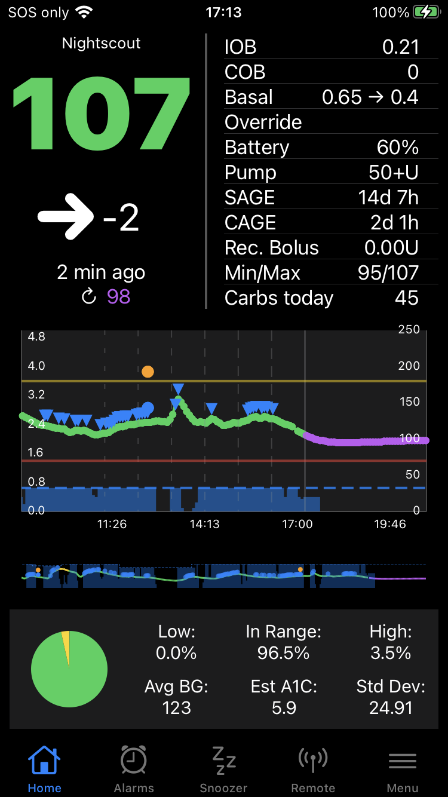

## *LoopFollow* 

*LoopFollow* is an open-source DIY (do-it-yourself) app that displays information for a person with diabetes in an easy-to-use interface. 
It combines information from multiple other apps and provides custom alerts. It runs on iPhone, iPad or Mac devices. With newer versions, some remote control features are available for the *Loop* and *Trio* apps.

*LoopFollow* was created because using different apps as a parent or caregiver of a person with diabetes can be cumbersome. 
Add in the extra details from looping with an Open Source Automated Insulin Delivery (OS-AID) app 
and flipping back and forth between various sources of information can be a challenge. 
Many loopers use *LoopFollow* for themselves because of the flexible (and loud) alarm options.

*LoopFollow*:

* Displays information from a *Nightscout* Site or Dexcom Share account
* Provides flexible alarms with a Snooze screen
* Displays Treatments and Statistics (requires *Nightscout* Site)
* Supports *Loop* and *Trio* OS-AID systems
    * Provides secure remote control (requires *Nightscout* Site and security configuration)
* Supports up to 3 loopers – each with their own unique app name
* Works with your Apple Watch
* Runs on an iPhone, iPad or a Mac computer

#### Home

An example of the Home screen for *LoopFollow* v5.0 and newer is shown in the graphic below:

{width=400}
{align="center"}

The toolbar at the bottom of the Home and Menu screens has 4 user-configurable icons in addition to the `Menu` icon. The icons shown in the graphic above are Home, Alarms, Snoozer and Remote.

#### New Features

The released version of *LoopFollow* is 6.1.0 and is built with the `main` branch.

See [New Feature Hightlights](faqs/lf-history.md#new-feature-highlights){: target="_blank" }

- - -

## Hardware Requirements

The *LoopFollow* app will run on any iPhone or iPad that supports iOS 16.6 or newer operating system and on any Mac computer with an Apple Silicon chip, i.e., M1, M2, M3, M4, etc.

- - -

## Build Options

*LoopFollow* can be built with a [Browser on any computer](build/build-options.md#building-options){: target="_blank" } or using [Xcode on a Mac](build/build-options.md#build-loopfollow-script-for-mac-xcode){: target="_blank" }.

### Community Support and Build Help

Community support for *LoopFollow* is available at

* [*LoopFollow* FaceBook page](https://www.facebook.com/groups/loopfollowlnl)
* [*Loop and Learn* Facebook](https://www.facebook.com/groups/LOOPandLEARN)
* [*Loop and Learn* Discord](https://discord.gg/KQgk3gzuYU)

Please use community support for Build questions. **Do not ask ChatGPT or any AI system; they tend to provide incorrect answers.**

To get build help with Browser Build, all we need is the *GitHub* URL for your fork of *LoopFollow*. Just replace `docs-test` in the example below with your *GitHub* username:

* Example: [https://github.com/docs-test/LoopFollow/actions](https://github.com/docs-test/LoopFollow/actions)

### Issues and Feature Requests

Issues and Feature Requests can be posted at [*LoopFollow* Issues](https://github.com/loopandlearn/LoopFollow/issues). Please review open issues and only open a new one if your problem or feature request is not already described. When reporting an issue, please specify the version of *LoopFollow* in which you noticed the problem.

 It is very unlikely that a new Issue needs to be opened when you are having trouble building. See [Community Support and Build Help](#community-support-and-build-help).

- - -

## *LoopFollow* Version

The *LoopFollow* app [release history](https://github.com/loopandlearn/LoopFollow/releases) is located in GitHub.

That link provides a reverse chronological list of all code updates.

In addition, at the bottom of the Settings screen for *LoopFollow*, the version you are using and latest versions are reported. This is an easy way to know if you should update your app.

## History

This code was originally developed by Jon Fawcett who turned over development and management to the *Loop and Learn* team. The primary developers are parents who love their children.
