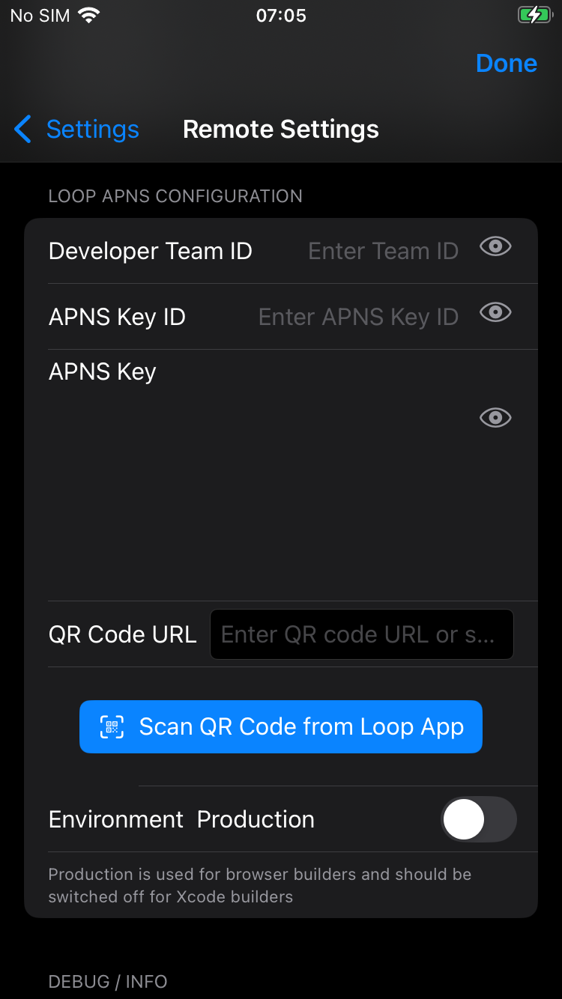

🚧 Documentation Under Construction 🚧

## Remote Control of the *Loop* App

This option is available for remote control of a *Loop* phone when you build the `dev` branch of *LoopFollow*. After testing and release, this will replace [Nightscout Remote Control for Loop](remote-control-nightscout.md#loopfollow--careportal-with-the-loop-app).

* After you [Configure for Remote Control](#configure-for-remote-control)
* You can [Use *LoopFollow* *Loop* Remote Control](#use-loopfollow-loop-remote-control)

- - -

## Use *LoopFollow* *Loop* Remote Control

Once the *LoopFollow* phone is [configured](#configure-for-remote-control), and while the *Loop* phone is handy, test sending Remote Commands. It is good to also have a browser open with the *Nightscout* URL displayed.

Remember to give the system time to update.

The sequence is *LoopFollow* to *Apple Push Notifications* to *Loop*, which uploads to *Nightscout* and then is displayed in the *LoopFollow* main screen.

{width="300"}
{align=center}

### Remote Meal

***More info coming soon!***

{width="300"}
{align=center}

### Remote Bolus

***More info coming soon!***

{width="300"}
{align=center}

### Overrides

***More info coming soon!***

{width="300"}
{align=center}

- - -

## FAQs for all Remote Commands

1. **If I have multiple *Nightscout* sites because I support multiple people with T1D looping, do I need multiple APNs Keys?**  
   **Answer**: No. If you support multiple people, you can use the one APNs key in each of their *Nightscout* sites.

1. **How can I tell if it worked?**  
   **Answer**: You will get an immediate response on *LoopFollow* whether it successfully sent an APNS command. 
   
    * It is still possible that the command won't go through to the *loop* phone - so wait until you see the remote entry on the *LoopFollow* display
    * If the command was sent but there was an error, you will see a gray dot on the *LoopFollow* plot instead of the desired remote entry. If you tap on the gray dot, the error message will be displayed.

    >   {width="300"}
    >   {align=center}

## FAQs on Remote Overrides

Don't forget to read [*Loopdocs*: Overrides](https://loopkit.github.io/loopdocs/operation/features/overrides/). 

For remote overrides in particular:

1. **Can I set a different override in *Nighscout* than I have programmed into&nbsp;_Loop_&nbsp;app?**  
   **Answer**: No. You will only be able to enact override presets already programmed into the Loop app.

1. **If I didn't start the override in *LoopFollow* (it was started in&nbsp;_Loop_&nbsp;itself), can I still use *LoopFollow* to cancel it?**  
   **Answer**: Yes. You can cancel an override set in&nbsp;_Loop_&nbsp;with *LoopFollow*.

1. **Can I replace an override set in&nbsp;_Loop_&nbsp;with an override set in *LoopFollow*?**  
   **Answer**: Yes.

1. **Can I see on *LoopFollow* when a temporary override has been set using the looper’s phone?**  
   **Answer**: Yes. 
   
    * There will be a green bar on the *LoopFollow* display within a few minutes. 
    * Once you see the bar, you can tap on Remote, Overrides to see the name of the override that is running. The details for that override are seen in the display below the active override. You may need to scroll down to find that override in the list to see the details.
    * The values set for the override may take up to 5 minutes to appear in the Information Table Display, at which time the %insulin needs and target are shown.

1. **Can a looper cancel a remote override**?  
   **Answer**: Yes. They can tap the heart icon :fontawesome-solid-heart-pulse: in&nbsp;_Loop_&nbsp;so that it is no longer highlighted. This turns off the override, regardless of where it was initiated.

1. **I set a remote override in *LoopFollow* but the Looper tapped the heart symbol :fontawesome-solid-heart-pulse: in the *Loop* app, so the override turned off. Will the override get reinstated  the next time&nbsp;_Loop_&nbsp;completes with internet access?**  
   **Answer**: No. The *APN* is only sent once. You can set the remote override again if need be.

1. **Can I schedule a remote override ahead of time using Nightscout?**    
   **Answer**: No. When you set a remote override in *LoopFollow*, it starts immediately and lasts for the duration programmed for that override in the *Loop* app. You can only set an override in advance using the *Loop* app.

## Remote Commands

Remote Commands to deliver a bolus or add a carb entry **require** a &nbsp;One Time Passcode&nbsp; (OTP).

!!! important "Minimum Versions: Loop 3&nbsp; and &nbsp;**Nightscout 14.2.6**"
    If your Nightscout version does not meet that minimum requirement, remote commands **might** be accepted but if they are, the time for the commands is always the current time. In other words, Carbs in the Past or Future might be accepted, but would be entered at the current time on the&nbsp;_loop_&nbsp;phone.

### Warnings on Remote Commands

!!! danger "**Duplicate Delivery Risk**"
    We want to highlight a very important risk before you get started.

    For safety, always assume a previous remote carbs/bolus was delivered. For motivation think of the following example:
    
    * You send a 5-unit remote bolus.
    * The bolus is delivered to the Looper.
    * *Nightscout* is having a temporary technical issue and doesn't show the bolus was received.
    * The *LoopFollow* display echoes what is shown in the *Nightscout* so you don’t see a delivery and you assume it failed.
    * You send another remote 5-unit bolus.
    * The second 5-unit bolus is delivered to the Looper (10 Units total).

You can see the danger of sending duplicate bolus/carbs so be careful. If a remote bolus/carb entry doesn’t show in *Nightscout* or *LoopFollow*, use your own judgment on whether enough time has passed to try again.

### Remote Bolus, Then Remote Carb

!!! warning "If sending both, choose Bolus then Carbs"
    If you plan to send a carb command remotely and later decide to issue a bolus command - STOP and consider.

    There are 2 scenarios of concern that could lead to too much insulin:
    
    * Dosing Strategy is **Temp Basal Only** (temporary basal)
        * _Loop_&nbsp;will initiate a max Temp Basal when it receives the carbs remote command
        * Your bolus is accepted next and takes place in addition to the high temporary basal
    * Dosing Strategy is **Automatic Bolus** 
        * _Loop_&nbsp;will initiate a percentage of the recommended dose when it receives the carbs remote command
        * Your bolus will be accepted and take place in addition to an automatic boluses or be rejected because a bolus is already in progress
    
    Typically, sending a remote carb entry alone is sufficient for&nbsp;_Loop_&nbsp;to know about the carbs and begin to dose for them.
    
    If you really want to both bolus for carbs and enter carbs, then do it in that order.
    
    1. The bolus, when accepted, may start a zero Temp Basal (temporary basal) (which is "safer")
    2. The carbs, when accepted, will cause the app to respond to the carbs
    3. In this case, the prediction includes both carbs and bolus
    
    ❗️ Remember - you should pause at least 60 seconds between remote commands or the One-Time-Password (OTP) will be rejected as having already been used.

- - -

## Configure for Remote Control

### *LoopFollow* Remote Setting Type 

The Remote Settings row in the *LoopFollow* Settings screen is used to select the type of remote access you wish to use.

{width="300"}
{align="center"}

!!! warning "The *Loop* Remote Control option is not available"
    The `Loop Remote Control` option is only available in *LoopFollow* if you have already entered a [*Nightscout* URL](#add-nightscout) with a default profile recognized as a *Loop* profile. 

* *Loop* Remote Control
    * Remote control with *LoopFollow* includes adding remote carbs, enacting remote bolus, and starting and canceling Overrides
    * Available with all versions of *Loop* 3
    * Requires *LoopFollow* `dev` branch (once released, the version will be 3.2 or later)
    * Continue with [Configure *LoopFollow* *Trio* Remote Control](#configure-loopfollow-trio-remote-control) to finish the configuration process

- - -

## Configure *LoopFollow* *Loop* Remote Control

> This is method for remote control of *Loop* 3.x (or newer) is currently available when using *LoopFollow* `dev` branch. This will be released as *LoopFollow* 3.2 at a later time.

### Guardrails

The maximum allowed entries for Bolus and Carbs are configured in the guardrails section. The default values are shown in the graphic below. Adjust this to what is appropriate for the individual.

These guardrails are for sending remote commands with *LoopFollow*. There are separate guardrails in the *Loop* app itself. Be sure the *LoopFollow* guardrails are at least as conservative as the *Loop* guardrails.

{width="300"}
{align=center}

### Credentials to Enable Loop Remote Control

When you select *Loop* Remote Control as the Remote Type in the *LoopFollow* app, you must fill in the (1) [Developer Team ID](#developer-team-id), (2) [APNS Key ID](#apns-key-id) and (3) [APNS Key](#apns-key).

{width="300"}
{align="center"}

### Developer Team ID

This is *Apple* Developer ID for whoever created the APNS Key. The developer must be the same as the person who built the *Loop* app.

### APNS Key ID

If you previously configured remote control with the *Loop* app, you already have an *Apple* Push Notification System (APNS) Key ID and Key. These were added to the config vars in your *Nightscout* site. See [Existing APNS](#existing-apns){: target="_blank" }. The value of the `LOOP_APNS_KEY_ID` goes here. 

If you have never created an APNS (or have lost the credentials), follow the directions in [New APNS](#new-apns){: target="_blank" } and copy the APNS Key ID into *LoopFollow* and save the value in your Secrets Reference file.

The APNS Key ID and APNS Key only need to be added to *LoopFollow* to enable *Loop* Remote Control. They do not need to be added to the *Nightscout* site.

> When creating the APNS, you must be logged in as a developer. The developer ID for the APNS must be the same as the one used for creating your *Loop* app or remote control will not work.

### APNS Key

If you previously configured remote control with the *Loop* app, you already have an *Apple* Push Notification System (APNS) Key ID and Key. These were added to the config vars in your *Nightscout* site. See [Existing APNS](#existing-apns){: target="_blank" }. The value of the `LOOP_APNS_KEY` goes here.

If you have never created an APNS (or have lost the credentials), follow the directions in [New APNS](#new-apns){: target="_blank" } and copy the APNS Key into *LoopFollow* and save the value in your Secrets Reference file.

### QR Code URL

This provides the One-Time Password needed for the *Loop* app to accept the APNS input as valid.

On the&nbsp;_Loop_&nbsp;phone, *Nightscout* must be included under the `Loop` -> Settings -> Services section. Navigate to Services and select *Nightscout*. Tap on the One-Time Password row to view the QR code.

When you need to configure your authentication method, you can either use a saved QR screenshot or scan the QR on the&nbsp;_Loop_&nbsp;phone.

Options:

* Have your Looper (or at least their phone) available
* Save a screenshot of their QR code
    * Keep this secure
    * Do not share the QR screenshot when asking for help

{width="650"}
{align="center"}

While you are on the *Loop* Settings -> Services -> NightScout screen, notice that the 6-digit number on the One-Time Password row updates every 30 seconds.

### Environment Production

If the *Loop* app was built with Browser Build, you must enable this row.

If the *Loop* app was built using Xcode on a Mac, you must disable this row.

### Debug / Info

This section indicates if *Loop* has uploaded required information to *Nightscout*.

The graphic below shows a properly configured *LoopFollow* when the *Loop* app was built using the Browser Build method.

{width="300"}
{align=center}

If you have empty rows in the Debug / Info screen, the most likely problem is the default profile is not coming from Trio. See [Update Profile](#update-profile). 
If you took those steps and still have missing rows, return to [Configure *LoopFollow* *Loop* Remote Control](#configure-loopfollow-trio-remote-control) and try again.

- - -

## Troubleshooting

This section is a placeholder for troubleshooting issues.

