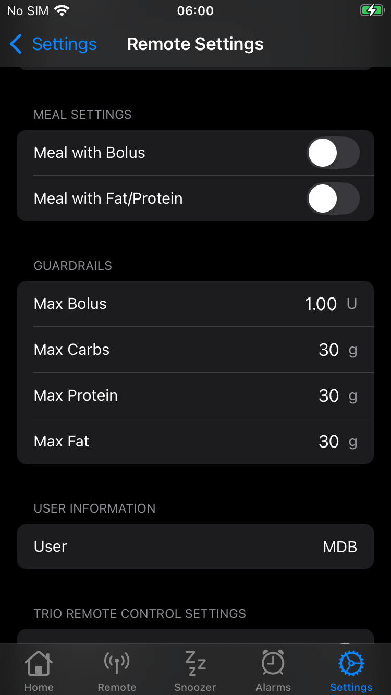

🚧 Documentation Under Construction 🚧

## Remote Control Overview

Trio can accept remote commands from *Nightscout* or from *LoopFollow*. There are a variety of options, but the final control of whether remote commands will be enacted rests with the *Trio* user. They can enable or disable remote control.

!!! warning "*Nightscout* version must be 15.0.2 or newer"
    To properly display the OpenAPS pill with *Trio* 0.5.x (or newer), your *Nightscout* version must be 15.0.2 (or newer). If you do not see the expected treatments or pills in the *Nightscout* dashboard, follow the steps to [Configure for OpenAPS](#configure-for-openaps).

The most powerful arrangement, for *Trio* 0.5.x (or newer), is to configure the *LoopFollow* app to use the *Trio* Remote Control (TRC) setting. This requires:

* *Trio* 0.5.x (or newer)
* *LoopFollow* version 2.4.0 (or newer)

??? question "How does this differ from *Trio* 0.2.x? (Click to Open/Close)"
    *Trio* can use *Nightscout* Careportal to enter `Carb Correction`, and start and cancel `Temporary Target`.
    
    * This was available in *Trio* 0.2.x and continues to be available in *Trio* 0.5.x (or newer).
    * See [*Nightscout* Remote Control](remote-control-nightscout.md#loopfollow-careportal-with-the-trio-app){: target="_blank" }

    *Trio* 0.2.x supported other remote options (using announcements via Careportal). 
    
    * Those options were replaced by the more secure *Trio* Remote Control for *Trio* 0.5.x (or newer)
    * **Using announcements to provide remote control of the *Trio* phone is no longer supported**

The bullets below take you to the indicated topics. The configuration steps are listed first but only need to be done once:

* [Configure *Trio* Phone for Remote Control](#configure-trio-phone-for-remote-control)
* [Configure *LoopFollow* for Remote Control](#configure-loopfollow-for-remote-control)
* [Use *LoopFollow* *Trio* Remote Control](#use-loopfollow-trio-remote-control)
* [Troubleshooting](#troubleshooting)
- - -

## Use *LoopFollow* *Trio* Remote Control

!!! warning "Important"
    The ability for the *Trio* app to be remotely controlled will be **disabled** when `Enable Remote Control` is turned OFF on the *Trio* phone, even if you have *LoopFollow* configured with the correct credentials. This is for the protection of the *Trio* user, so that they **always** are the primary controller of their insulin dosing app.

    The APNS commands will report success on the *LoopFollow* app, but you will see a gray dot on the plot. The message is "Remote command received, but remote control is disabled in settings. Ignoring the command."

Once the *LoopFollow* app is configured, and while the *Trio* phone is handy, test sending Remote Commands. It is good to also have a browser open with the *Nightscout* URL displayed.

Remember to give the system time to update.

The sequence is *LoopFollow* to *Apple Push Notifications* to *Trio*, which uploads to *Nightscout* and then is displayed in the *LoopFollow* main screen.

{width="300"}
{align=center}

### Remote Meal

***More info coming soon!***

When entering meals and choosing to schedule the meal, any bolus included in the meal is enacted immediately. Only the carb entry is entered according to the schedule.

{width="300"}
{align=center}

### Remote Bolus

***More info coming soon!***

### Temp Target

***More info coming soon!***

### Overrides

***More info coming soon!***

- - -

## Configure *Trio* Phone for Remote Control

> The graphics displayed on this page are associated with *Trio* version 0.5.x or newer. The same setting is available in older version of *Trio* but in a different location in the menu structure.

**Default:** _OFF_

Remote control must be enabled on the *Trio* phone or no remote information is accepted by the *Trio* phone.

> You can search for this screen in *Trio* settings or go through the sequence: Trio, Settings, Features, Remote Control.

### Shared Secret

Once Remote Control is enabled, a Shared Secret is available. This is only used if you want to use *Trio* Remote Control with *LoopFollow*.

The graphic below is on the *Trio* phone:

{width="300"}
{align="center"}

When Remote Control is enabled on the *Trio* app and the *LoopFollow* app is properly configured, you can add carbs, send boluses, set or cancel overrides or temporary targets from the *LoopFollow* app to the *Trio* phone via *Apple* push notifications.

The `SHARED SECRET` should be copied from the *Trio* phone and added to the [`Shared Secret`](#shared-secret_1) row of the *LoopFollow* Remote Settings screen as part of the configuration for using *LoopFollow*.

!!! warning "Important"
    The ability for the *Trio* app to be remotely controlled will be **disabled** when `Enable Remote Control` is turned OFF on the *Trio* phone, even if you have *LoopFollow* configured with the correct shared secret or your *Nightscout* URL has Careportal access. This is for the protection of the *Trio* user, so that they **always** are the primary controller of their insulin dosing app.

## Configure *LoopFollow* for Remote Control

### *LoopFollow* Remote Setting Type 

The Remote Settings row in the *LoopFollow* Settings screen is used to select the type of remote access you wish to use.

{width="300"}
{align="center"}

!!! question "The *Trio* Remote Control option is not available"
    The `Trio Remote Control` option is only available in *LoopFollow* if you have already entered a [*Nightscout* URL](#add-nightscout) with a default profile recognized as a *Trio* profile. Review [Troubleshooting](#troubleshooting) for possible reasons for not seeing the option.

* *Nightscout* option
    * Remote control with *LoopFollow* is limited to starting and canceling Temp Targets
    * Available with *Trio* 0.2.x and newer
* *Trio* Remote Control option
    * Remote control with *LoopFollow* includes adding remote carbs, enacting remote bolus, and starting and canceling Temp Targets and Overrides
    * Requires *Trio* 0.5.x (or newer) and *LoopFollow* 2.4.x (or newer)
    * Continue with [Configure *LoopFollow* *Trio* Remote Control](#configure-loopfollow-trio-remote-control) to finish the configuration process

- - -

## Configure *LoopFollow* *Trio* Remote Control

> This is supported for *Trio* 0.5.x (or newer) when using *LoopFollow* 2.4.0 (or newer).

### Meal Settings

The user can decide to enable or disable two features independently.

* Meal with Bolus
    * When enabled, a bolus command can be sent at the same time as the meal entry
* Meal with Fat/Protein 
    * When enabled, the user is presented with a Protein and Fat row in addition to the Carbs and Bolus Amount rows

Refer to the graphic below which shows default settings for meal settings and guardrails rows. The user row is filled in.

{width="300"}
{align=center}

### Guardrails

The maximum allowed entries for Bolus, Carbs, Protein, and Fat are configured in the guardrails section. The default values are shown in the graphic in the [Meal Settings](#meal-settings) section. Adjust this to what is appropriate for the individual.

These guardrails are for sending remote commands with *LoopFollow*. There are separate guardrails in the *Trio* app itself. Be sure the *LoopFollow* guardrails are at least as conservative as the *Trio* guardrails.

!!! warning "Do not exceed *Trio* Guardrails"
    Example:

    * *LoopFollow* guardrail is 10 U bolus
    * *Trio* guardrail is 8 U bolus
    * Send remote bolus amount of 10 U from *LoopFollow*
        * *LoopFollow* shows a success message, meaning the APNS request was successfully sent to the *Trio* phone
        * The *Trio* phone rejects the request because it exceeds the guardrail
        * A gray dot shows up on the *LoopFollow* screen, tapping it shows the message "Command rejected: bolus amount (10 units) exceeds the maximum allowed (8 units)"

### User

The person using the *LoopFollow* app should enter the name they want to show up as having entered this entry. 

* At the current time, this is not used by *LoopFollow* for Trio

Refer to the graphic in the [Meal Settings](#meal-settings) section.

### Credentials

### Shared Secret

This is the unique shared secret that can be generated or entered into the *Trio* app in the Remote Control screen. The shared secret in *Trio* and *LoopFollow* must match to provide the ability to remotely send commands to this *Trio* app.

> Please use a secure secret - the [automatically generated secret](#configure-trio-phone-for-remote-control) is recommended.

### APNS Credentials

When you select *Trio* Remote Control as the Remote Type in the *LoopFollow* app, you must fill in the (1) [Shared Secret](#shared-secret), (2) [APNS Key ID](#apns-key-id) and (3) [APNS Key](#apns-key).

| Default Remote Settings | Configured Remote Settings |
|:-:|:-:|
| {width="300"} | {width="300"} |

### APNS Key ID

If you previously configured remote control with the *Loop* app, you already have an *Apple* Push Notification System (APNS) Key ID and Key. These were added to the config vars in your *Nightscout* site. See [Existing APNS](#existing-apns). The value of the `LOOP_APNS_KEY_ID` goes here. Be sure to read the [Configure for OpenAPS](#configure-for-openaps) section about steps to make *Nightscout* and *LoopFollow* work with Trio.

If you have never created an APNS (or have lost the credentials), follow the directions in [New APNS](#new-apns) and copy the APNS Key ID into *LoopFollow* and save the value in your Secrets Reference file.

> When creating the APNS, you must be logged in as a developer. The developer ID for the APNS must be the same as the one used for creating your *Trio* app or remote control will not work.

### APNS Key

If you previously configured remote control with the *Loop* app, you already have an *Apple* Push Notification System (APNS) Key ID and Key. These were added to the config vars in your *Nightscout* site. See [Existing APNS](#existing-apns). The value of the `LOOP_APNS_KEY` goes here.

If you have never created an APNS (or have lost the credentials), follow the directions in [New APNS](#new-apns) and copy the APNS Key into *LoopFollow* and save the value in your Secrets Reference file.

### Debug / Info

This section indicates if *Trio* has uploaded required information to *Nightscout*.

The graphic below shows a properly configured *LoopFollow* when the *Trio* app was built using the Browser Build method.

{width="300"}
{align=center}

If you have empty rows in the Debug / Info screen, the most likely problem is the default profile is not coming from Trio. See [Update Profile](#update-profile). 
If you took those steps and still have missing rows, return to [Configure *LoopFollow* *Trio* Remote Control](#configure-loopfollow-trio-remote-control) and try again.

- - -

## Troubleshooting

This section covers known troubleshooting issues:

* *Nightscout* not displaying *Trio* data: [Configure for OpenAPS](#configure-for-openaps)
* Was able to select *Trio* Remote Control in *LoopFollow* but it is no longer working: [Stop *Nightscout* access from the *Loop* app](#stop-nightscout-access-from-the-loop-app)
* Cannot select *Trio* Remote Control in *LoopFollow*: [Update Profile](#update-profile)

### Configure for OpenAPS

The *Nightscout* version must be 15.0.2 (or newer) to properly display the OpenAPS pill with *Trio* 0.5.x (or newer). Check your revision: *Nightscout* URL, Menu, scroll to bottom and examine the About section.

If you transitioned from the *Loop* app, you must make some modifications to *Nightscout* before you will be successful viewing your *Trio* data in your *Nightscout* site.

In *Nightscout*, you need to modify these config vars:

| Config Var | `Loop` |    `Trio` |
|:--|:--|:--|
| `ENABLE` | `loop` | `openaps` |
| `SHOW_PLUGINS` | `loop` | `openaps` |
| `SHOW_FORECAST` | `loop` | `openaps` |

Remember to restart the *Nightscout* server (restart dynos) after updating these variables.

### Stop *Nightscout* uploads from other apps

If you were previously running the *Loop* app or the *iAPS* app:

* Remove *Nightscout* from *Loop* Services or *iAPS* services
* Add *Nightscout* as a Service to *Trio*
    * You need the *Nightscout* URL and the API_SECRET

In addition to this step, you may need to force the profile (from Trio) to upload to *Nightscout* and overwrite the one stored as the default profile in *Nightscout*.

### Update Profile

!!! warning "Must on *Trio* 0.5.x (or newer)"
    If you are on *Trio* 0.2.x, you might see the option for *Trio* Remote Control in *LoopFollow* Remote Settings, but you can't use it. See [Use *LoopFollow* *Nightscout* Remote Control](#use-loopfollow-nightscout-remote-control).

If you were previously running the *Loop* app or the *iAPS* app, [Stop *Nightscout* upload](#stop-nightscout-uploads-from-other-apps) from those apps and then force the profile to update.

To force a profile to update to *Nightscout*, go to the *Trio* app and toggle Allow Uploading to Nightscout off (disable) and then enable it again.

Once the user has toggled "Allow Uploading to Nightscout", *LoopFollow* needs to be refreshed (pull down glucose value to refresh) or re-started in order to fetch the correct information. *LoopFollow* will refresh eventually, but most users are impatient.

If the Debug Info in *LoopFollow* is missing a Device Token or a Bundle ID, as shown on the left side of the graphic, you need to make sure the *Loop* app is no longer uploading to *Nightscout* and force the profile to update.

{width=600}
{align=center}

### *Trio* Remote Control Stops Working

Other signatures that you need to [force the update](#update-profile) are shown in the graphics below - for both these instances, *Trio* Remote Control (TRC) was working with *LoopFollow* and then stopped working:

| TRC Option Not Allowed | TRC Error |
|:-:|:-:|
| {width="300"} | {width="300"} |

- - -
