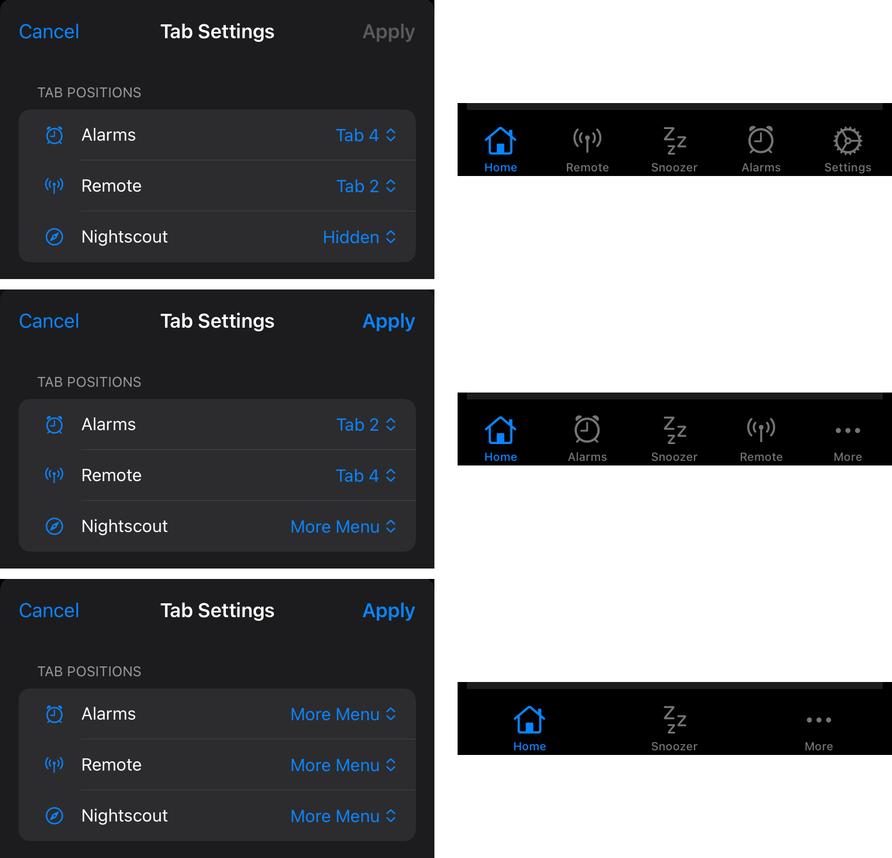

🚧 Documentation Under Construction 🚧

<!--todo-->
<!--Notes: be sure to add this info

-->

## *LoopFollow* Features

Most features are self-explanatory. Use the [Settings Screen](lf-setup.md#settings-screen){: target="_blank" } to navigate to the appropriate section to adjust the app settings.

Some features require more explanation. 

- - -

## Toolbar Tab Customization

The toolbar or tab bar at the bottom of the *LoopFollow* screen is used for rapid access to specific features. This navigation feature can support up to 5 tabs, but there are 6 options that could be placed there. With version 3.1 and newer, the tabs displayed are customizable.

??? tip "Historical Tabs (Click to open/close)"
    Historically the 5 tabs were:

    * tab 1: Home
    * tab 2: Alarms or Remote Control
    * tab 3: Snoozer
    * tab 4: Nightscout site
    * tab 5: Settings

    The updated design is that tabs 2 and 4 are optional and tab 5 can be either settings or the &hellip;&nbsp;More icon.

The new arrangement is:

* tab 1: Home
* tab 2: Configurable
* tab 3: Snoozer
* tab 4: Configurable
* tab 5: Configurable (Settings or &hellip;&nbsp;More)

### Instructions for Tab Selection

After choosing the Tab Selection row from *LoopFollow* Settings, these tab options can be placed as desired in your choice of tab 2, tab 4, the &hellip;&nbsp;More Menu or Hidden. 

* Alarms
* Remote
* Nightscout site

> If you tap cancel in upper left - no changes are saved. 

> Once you tap `Apply` in upper right, your toolbar is updated.

> {width="350"}
{align="center"}

### Example Tab Choices

To clarify the selection process, the graphic below shows 3 choices for Tab Settings on the left, with the resultant toolbar on the right.

{width="700"}
{align="center"}

- - -

## Background Refresh Settings

LoopFollow has traditionally provided an option to play a silent audio as a trick to allow it to wake up when in the background or when the phone is locked. This has several drawbacks including battery drain and limited reliability.

With LoopFollow version 2.2.9 or newer, an additional method is provided using an external device to provide a heartbeat. This can be a radiolink device, if you have one available, or a used Dexcom Transmitter (G5/ G6/ ONE/ Anubis) or Sensor (G7/ ONE+). The batteries on Dexcom devices continue to provide power to the Bluetooth system, giving a heartbeat at about 5 minute intervals. The radiolink devices provide a heartbeat every minute.

### Bluetooth Heartbeat

#### Why was this added?

LoopFollow can use a background silent audio to keep iOS from killing the app, but this trick puts an extra load on the phone battery and it is known to stop working in some cases, such as when using a Timer on your phone

* If the silent tune is working well for you, there’s no need to change
* If you’ve been experiencing significant battery drain you may want to use a Bluetooth Hearbeat

#### How does it work?

* You can choose to use a radiolink device or an expired Dexcom device as a heartbeat
* This can save significantly on the battery used by LoopFollow and provides more reliable ability to wake up LoopFollow out of background mode to check for alarm status.

#### What devices are supported?

These devices can provide a constant Bluetooth connection for your LoopFollow phone:

* Radiolink:  RileyLink, OrangeLink,  Emalink
* Dexcom Device (the battery can last for months after it is no longer in service with a sensor)
    * Dexcom G5/G6/ONE/Anubis transmitter
    * Dexcom G7/ONE+ sensor

If you use LoopFollow on your Looping phone for the features offered, you can connect to your own Dexcom device. You don’t need to use an expired device in addition.

#### How do I configure Bluetooth Heartbeat?

These graphics walk you through how to select the Background Refresh Type.  The example shows the steps if you choose to use a Dexcom Device (G5/G6/ONE/G7/ONE+). A similar process is used for a radiolink device.

If the person using LoopFollow is also wearing a Dexcom or radiolink, they should choose their own device. The RSSI is a measure of the strength of the signal. It is normal for the Dexcom device to disconnect. It will reconnect regularly.

🚧 import graphics from lnl 🚧

- - -

## Real-Time Watch Updates using Contact

Updated Method for Watch Display of Real Time Glucose.

Follow your Looper’s glucose value in real time on your Apple watch by adding a complication! 

> Note: a new method is required because the old “calendar” method no longer works for iOS 18. You must have LoopFollow v2.2.8 or newer to use this method.

Features include:

* Options for delta value or arrow
* Dynamic font size

### Step-by-Step Instructions

It is probably easiest to view the video for Set Up LoopFollow Contact Complication on Your Apple Watch, but a bullet list is also provided below

Video, [How to add a complication for real-time watch display](https://youtu.be/xQ6pd80tKT4)

Bullet List with Instructions:

1. Enable glucose Updates in Loop Follow
    * Open the Loop Follow app on your iPhone
    * Go to Settings > Integrations > Contact
    * Toggle on “Enable Contact BG Updates”
        * If a permission prompt appears, tap “Allow” to let Loop Follow access your contacts
        * (The app will automatically create a contact named LoopFollow – BG for you.)
2. Open the Watch App
    * On your iPhone, open the Watch app
    * Tap “My Watch” at the bottom, if it isn’t already selected
3. Choose a Watch Face
    * Scroll down and tap “Face Gallery” or choose an existing watch face under My Faces
    * Pick a watch face that supports complications (e.g., Infograph Modular or Modular)
4. Customize the Complications
    * Tap the watch face you selected to edit its settings
    * Find a Complication slot where you want the glucose contact to appear
    * Select the slot, select the ‘Contacts’ complication, select ‘More…’, scroll through the contacts, and choose LoopFollow – BG
5. Save Your Watch Face
    * Tap “Add” or “Set as Current Watch Face” to apply the changes
    * Check your Apple Watch to confirm the LoopFollow – BG complication is showing your glucose data
6. (OPTIONAL) If you follow more than one Looper
    * Repeat these steps. You can follow up to 3 Loopers using the various LoopFollow-1….-3 builds
    * Each contact will have a distinct name and show up with a different color on your watch face

You’re ready to monitor your glucose data directly on your Apple Watch!

🚧 import graphics from lnl 🚧

- - -

## Remote Control with *LoopFollow*

Do not skip the overview page if you have not yet configured *LoopFollow* for Remote Control.

* [Remote Control Overview](../remote/remote-control-overview.md)

There are separate pages for the 3 different remote control options. (No page is provided if `None` is selected).
Quick access is provided using these links once you have configured *LoopFollow* for Remote Control:

* None
* [*Nightscout*](../remote/remote-control-nightscout.md){: target="_blank" } (*LoopFollow* offers actions that can be done from a *Nightscout* Careportal)
* [*Loop* Remote Control](../remote/remote-control-loop.md){: target="_blank" } (in development: only available with a *Loop* URL)
* [*Trio* Remote Control](../remote/remote-control-trio.md){: target="_blank" }: requires Trio 0.5.x or newer

