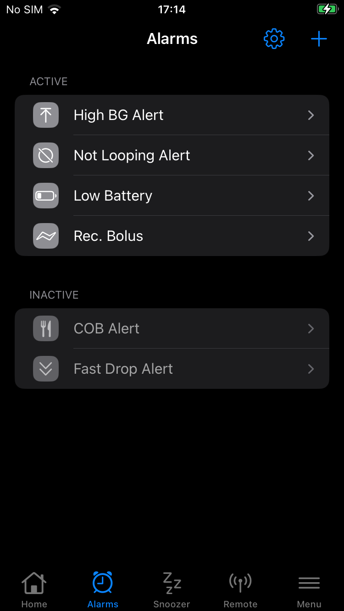
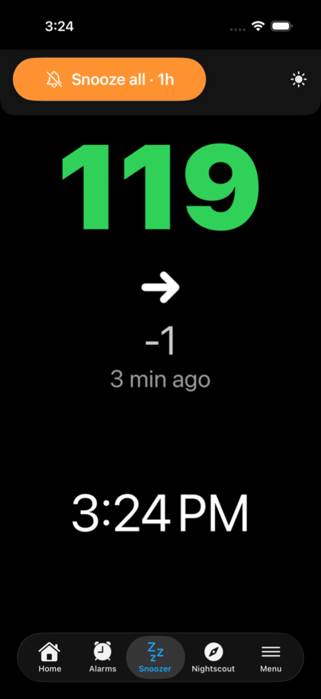
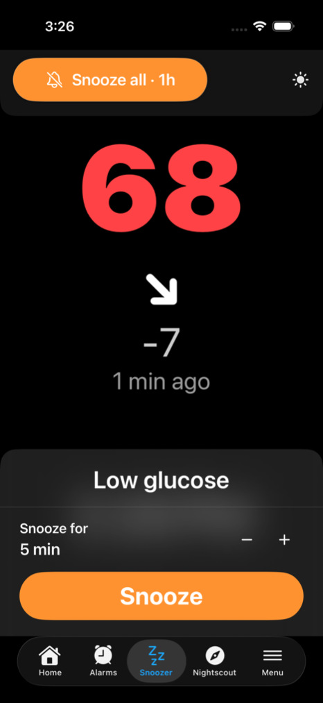
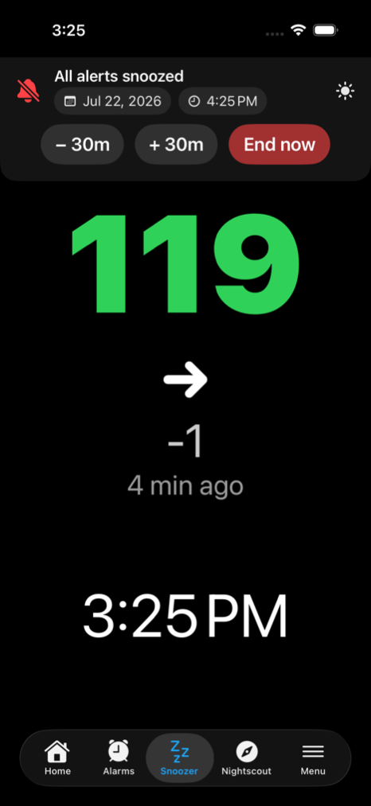
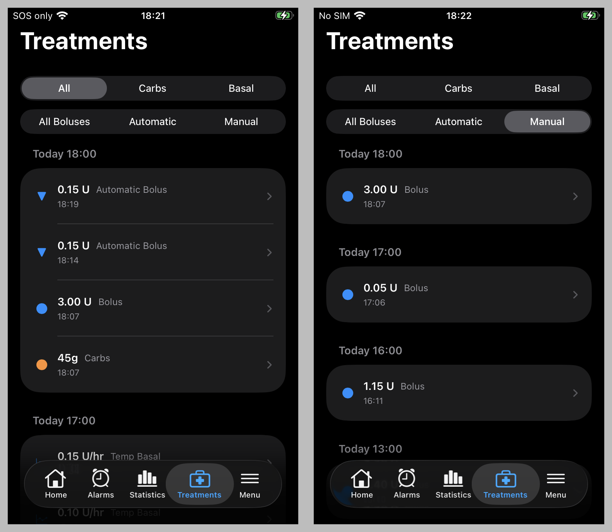

## *LoopFollow* Features

Most features and the settings that control them are self-explanatory and documented within the app. Some documentation is provided below.

- - -

## Status Banner

When *LoopFollow* has trouble reaching your data source or keeping itself awake in the background, it shows a dismissable banner across the top of the screen. The banner is visible on every tab and pushes the content down rather than covering it. It explains *what* went wrong so you can fix it, instead of the app silently showing no data.

### What it reports

* **Nightscout problems** — after a failed download, *LoopFollow* checks your site and reports the cause, for example *"The token is invalid."*, *"A token is required."*, *"The site was not found."*, or *"A network error occurred."* If the site is reachable but the data still didn't load, a softer warning says so.
* **Dexcom Share problems** — a failed *Dexcom Share* login is explained in plain language (account not found, incorrect username or password, or too many failed attempts). If *Nightscout* is also configured, *LoopFollow* falls back to it and the banner notes that data keeps flowing using *Nightscout* as backup.
* **Frequent heartbeat dropouts** — when a [Bluetooth heartbeat](#bluetooth-heartbeat) device starts arriving late repeatedly within the last hour — a typical sign of a dying transmitter battery — the banner suggests checking the transmitter/RileyLink/pod battery or Bluetooth range. A single late beat never triggers it.

### Clearing and dismissing

* A banner clears **automatically** when its source recovers (the next successful download, or a clean heartbeat window) or when you remove that source (URL/credentials cleared, device disconnected).
* Tapping **✕** hides the banner. The same problem stays hidden for about 30 minutes and then reappears if it is still occurring; a *different* problem appears right away.
* When more than one source has a problem, the most serious message is shown first; dismissing it reveals the next one.

- - -

## Alarms

When you select the Alarms Feature, the initial screen will be blank. By tapping on the plus sign upper right, you can add as many alarms as desired. There is quick access to the overall [Alarm Settings](lf-setup.md#alarms) by tapping the gear icon on this screen.

Both the alarms list and the **Add Alarm** sheet have a search field. On the alarms list, type to filter your configured alarms by name or alarm type. In the **Add Alarm** sheet, type to filter the available alarm types by name, description, or group — non-matching groups are hidden. When nothing matches, a **No Results** message is shown.

The graphic below shows a few typical alarms that might be chosen.

{width="350"}
{align="center"}

When you tap on a given alarm, you can customize the settings in a number of ways. An example for the Low BG Alert is shown below. Once you customize an alarm, you can enable or disable it quickly while maintaining your custom settings.

{width="700"}
{align="center"}

The graphic below shows the many types of alarms that are available with *LoopFollow*.

{width="700"}
{align="center"}

### Alarm Sounds

Each alarm plays a tone that you choose in the alarm's settings. Tap **Choose Tone** to open the tone picker, where you can preview and select from the built-in tones.

#### Custom Sounds

You can also use your own audio as an alarm tone. In the tone picker, the **Custom** section at the top offers two ways to add sounds:

* **Import Sound…** — opens the Files browser so you can pick an audio file.
* **Shared folder** — drop audio files into *LoopFollow*'s folder in the Files app; they are picked up automatically the next time you open the tone picker.

Imported sounds must be a supported audio format (mp3, wav, m4a, aac, aif/aiff, caf), no larger than **2 MB**, and no longer than **30 seconds**.

Custom sounds are stored on your device only and are **not** included in a settings export. Swipe a custom sound to delete it; any alarm still using a deleted sound falls back to a built-in tone.

### Skip Options

Some alarms can be told to stay quiet when the situation is already correcting itself. These toggles are **off by default**, so existing alarms behave exactly as before.

| Alarm | Option | Behavior |
|:--|:--|:--|
| Low BG | **Skip if BG is rising** | Stays silent while glucose is rising; only sounds when the latest reading is flat or still falling. |
| High BG | **Skip if BG is falling** | Stays silent while glucose is falling; only sounds when the latest reading is flat or still rising. |
| Low Battery (phone) | **Skip while charging** | Stays silent while the phone is charging. Requires the uploader to report charging status; if it doesn't, the alert still sounds. |

For the two BG alarms, the direction is judged from the last two readings.

### Predictive Low Alert

The Low BG Alert can warn you *before* glucose actually goes low, based on the forecast from the looping app. In the alarm's settings, set **Predictive** to the number of minutes to look ahead in the forecast (up to 60); if any forecast value in that window is at or below the alarm's threshold, you are warned early. Set it to 0 to alert only on actual readings.

* For *Loop*, the forecast that *Loop* uploads is used.
* For *Trio*, the lowest of *Trio*'s four forecast lines (ZT, IOB, COB, UAM) at each point in time is used.

### Alarm Types Reference

The table below lists every alarm type available in *LoopFollow*, organized by group.

#### Glucose

| Alarm | Description |
|:--|:--|
| Low BG Alert | Alerts when BG goes below a limit, now or in the [forecast](#predictive-low-alert) |
| High BG Alert | Alerts when BG rises above a limit |
| Fast Drop Alert | Rapid downward BG trend |
| Fast Rise Alert | Rapid upward BG trend |
| Missed Reading Alert | No CGM data for a configurable number of minutes |
| Temporary Alert | One-time BG limit alert (above and/or below) |

#### Insulin / Food

| Alarm | Description |
|:--|:--|
| IOB Alert | High insulin-on-board |
| COB Alert | High carbs-on-board |
| Missed Bolus Alert | Carbs entered without a matching bolus |
| Future Carbs Alert | Reminder when future carbs are due |
| Rec. Bolus | Recommended bolus issued |

#### Device / System

| Alarm | Description |
|:--|:--|
| Low Battery | Phone battery low |
| Battery Drop | Phone battery drops quickly within a monitoring window |
| Pump Insulin Alert | Reservoir level low |
| Pump Battery Alert | Pump battery low |
| Pump Change Alert | Pump change due |
| Sensor Change Alert | Sensor change due |
| Not Looping Alert | Loop hasn't completed within a configurable number of minutes |
| Looping app expiration | Looping-app build is expiring soon |
| Nightscout Database Size | *Nightscout* database has filled to or above a chosen percentage of its configured size limit (defaults to 75%, daytime only) |

#### Override / Target

| Alarm | Description |
|:--|:--|
| Override Started | An override just started |
| Override Ended | An override ended |
| Temp Target Started | A temp target started |
| Temp Target Ended | A temp target ended |

- - -

## Snoozer

The Snoozer is a dedicated tab designed for the night stand and at-a-glance monitoring: a black screen with a large glucose value, the trend arrow, the delta, how long ago the reading arrived, and a clock. When the reading is stale, the glucose value is crossed out. Like the other features, the Snoozer can be placed in the toolbar using [Settings: Tabs](lf-setup.md#tabs).

{width="350"}
{align="center"}

Two options in [Settings: General](lf-setup.md#general) tailor the screen: **Show Display Name** adds the app name (handy when following more than one person), and **Snoozer emoji** adds a face that reflects the current glucose.

### When an Alarm Sounds

When an alarm fires, a card appears at the bottom of the Snoozer showing the alarm name, a **Snooze for** stepper, and a **Snooze** button. The stepper's unit and limits depend on the alarm type — minutes for most alarms, hours or days for slow-moving ones like the expiration alerts. Setting the stepper to 0 turns the button into **Acknowledge**, which silences the alarm without snoozing it.

{width="350"}
{align="center"}

### Snooze All Alarms

Tap anywhere on the Snoozer screen to show the bar at the top. When nothing is snoozed, it offers a one-tap **Snooze all · 1h** button, and a sun or moon symbol indicates whether your daytime or nighttime alarm hours are active. The bar hides itself again after a few seconds.

While a global snooze is active, the bar reads **All alerts snoozed** and shows the end date and time — tap either one to adjust it — along with **− 30m** and **+ 30m** buttons and **End now**. Adjusting the end time below the current time also ends the snooze.

{width="350"}
{align="center"}

- - -

## Remote Control with *LoopFollow*

Do not skip the overview page if you have not yet configured *LoopFollow* for Remote Control.

* [Remote Control Overview](../remote/remote-control-overview.md)

There are separate pages for the different remote control options. (No page is provided if `None` is selected).
Quick access is provided using these links once you have configured *LoopFollow* for Remote Control:

* None
* [*Loop* Remote Control](../remote/remote-control-loop.md){: target="_blank" }
* [*Trio* Remote Control](../remote/remote-control-trio.md){: target="_blank" }

> As of *LoopFollow* 6.2, *Nightscout* remote commands are no longer supported in *LoopFollow*.

- - -

## Treatments

The treatments screen displays all treatments downloaded from the Nightscout Site with user-selectable filters on treatment type.

{width=700}
{align="center"}

- - -

## Statistics

The Statistics screen displays a variety of plots and values. This requires an associated Nightscout Site. If the Nightscout site is limited in the days of data, it will be noticeable in the Data Availability metric on the first row.

{width=700}
{align="center"}

- - -

## Background Refresh

*LoopFollow* has traditionally provided an option to play a silent audio as a trick to allow it to wake up when in the background or when the phone is locked. This has several drawbacks including battery drain and limited reliability.

With *LoopFollow* version 2.2.9 or newer, an additional method is provided using an external device to provide a heartbeat. This can be a radiolink device, if you have one available, or a used Dexcom Transmitter (G5/ G6/ ONE/ Anubis) or Sensor (G7/ ONE+). The batteries on Dexcom devices continue to provide power to the Bluetooth system, giving a heartbeat at about 5 minute intervals. The radiolink devices provide a heartbeat every minute.

### Bluetooth Heartbeat

#### Why was this added?

*LoopFollow* can use a background silent audio to keep iOS from killing the app, but this trick puts an extra load on the phone battery and it is known to stop working in some cases, such as when using a Timer on your phone

* If the silent tune is working well for you, there’s no need to change
* If you’ve been experiencing significant battery drain you may want to use a Bluetooth Heartbeat

#### How does it work?

* You can choose to use a radiolink device or an expired Dexcom device as a heartbeat
* This can save significantly on the battery used by *LoopFollow* and provides more reliable ability to wake up *LoopFollow* out of background mode to check for alarm status.

#### What devices are supported?

These devices can provide a constant Bluetooth connection for your *LoopFollow* phone:

* Radiolink:  RileyLink, OrangeLink,  Emalink
* Dexcom Device (the battery can last for months after it is no longer in service with a sensor)
    * Dexcom G5/G6/ONE/Anubis transmitter
    * Dexcom G7/ONE+ sensor

If you use *LoopFollow* on your Looping phone for the features offered, you can connect to your own Dexcom device. You don’t need to use an expired device in addition.

#### How do I configure Bluetooth Heartbeat?

These graphics walk you through how to select the Background Refresh Type.  The example shows the steps if you choose to use a Dexcom Device (G5/G6/ONE/G7/ONE+). A similar process is used for a radiolink device.

If the person using *LoopFollow* is also wearing a Dexcom or radiolink, they should choose their own device. The RSSI is a measure of the strength of the signal. It is normal for the Dexcom device to disconnect. It will reconnect regularly.

🚧 import graphics from lnl 🚧

- - -

## Real-Time Watch Updates using Contact

Updated Method for Watch Display of Real Time Glucose.

Follow your Looper’s glucose value in real time on your Apple watch by adding a complication! 

> Note: a new method is required because the old “calendar” method no longer works for iOS 18. You must have *LoopFollow* v2.2.8 or newer to use this method.

Features include:

* Options for delta value or arrow
* Dynamic font size

### Step-by-Step Instructions

It is probably easiest to view the video for Set Up *LoopFollow* Contact Complication on Your Apple Watch, but a bullet list is also provided below

Video, [How to add a complication for real-time watch display](https://youtu.be/xQ6pd80tKT4)

Bullet List with Instructions:

1. Enable glucose Updates in *LoopFollow*
    * Open the *LoopFollow* app on your iPhone
    * Go to Settings > Integrations > Contact
    * Toggle on “Enable Contact BG Updates”
        * If a permission prompt appears, choose **“Allow Full Access”** (do **not** choose “Select Contacts…” / Limited Access)
            * *LoopFollow* needs Full Access because it creates and keeps its own *LoopFollow* – BG contact up to date; Limited Access will prevent the complication from updating
        * (The app will automatically create a contact named *LoopFollow* – BG for you.)
2. Open the Watch App
    * On your iPhone, open the Watch app
    * Tap “My Watch” at the bottom, if it isn’t already selected
3. Choose a Watch Face
    * Scroll down and tap “Face Gallery” or choose an existing watch face under My Faces
    * Pick a watch face that supports complications (e.g., Infograph Modular or Modular)
4. Customize the Complications
    * Tap the watch face you selected to edit its settings
    * Find a Complication slot where you want the glucose contact to appear
    * Select the slot, select the ‘Contacts’ complication, select ‘More…’, scroll through the contacts, and choose *LoopFollow* – BG
5. Save Your Watch Face
    * Tap “Add” or “Set as Current Watch Face” to apply the changes
    * Check your Apple Watch to confirm the *LoopFollow* – BG complication is showing your glucose data
6. (OPTIONAL) If you follow more than one Looper
    * Repeat these steps. You can follow up to 3 Loopers using the various *LoopFollow*-1….-3 builds
    * Each contact will have a distinct name and show up with a different color on your watch face

You’re ready to monitor your glucose data directly on your Apple Watch!

🚧 import graphics from lnl 🚧

