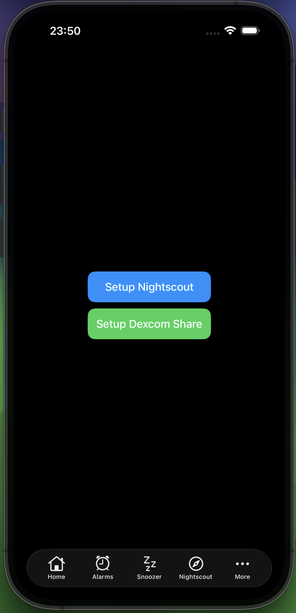
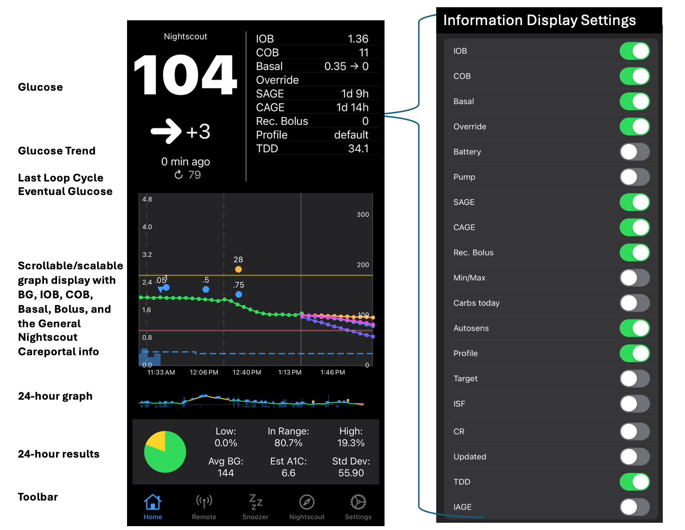
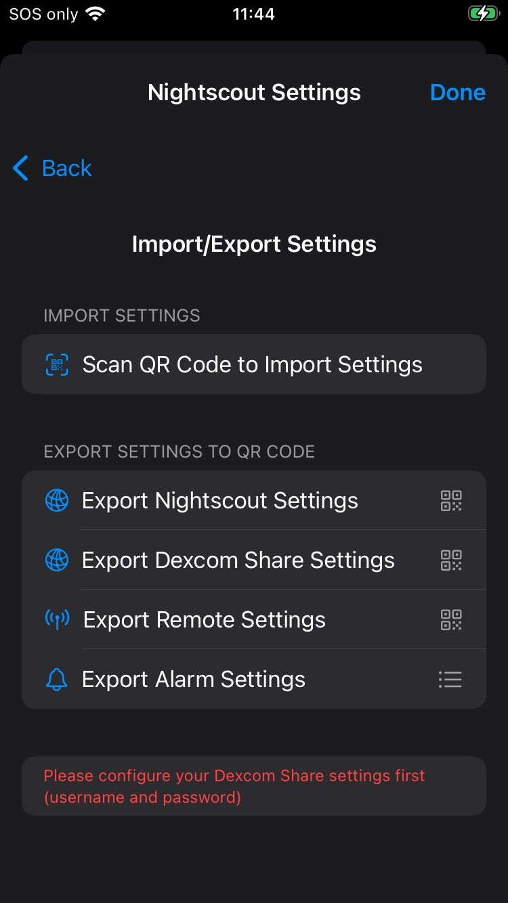
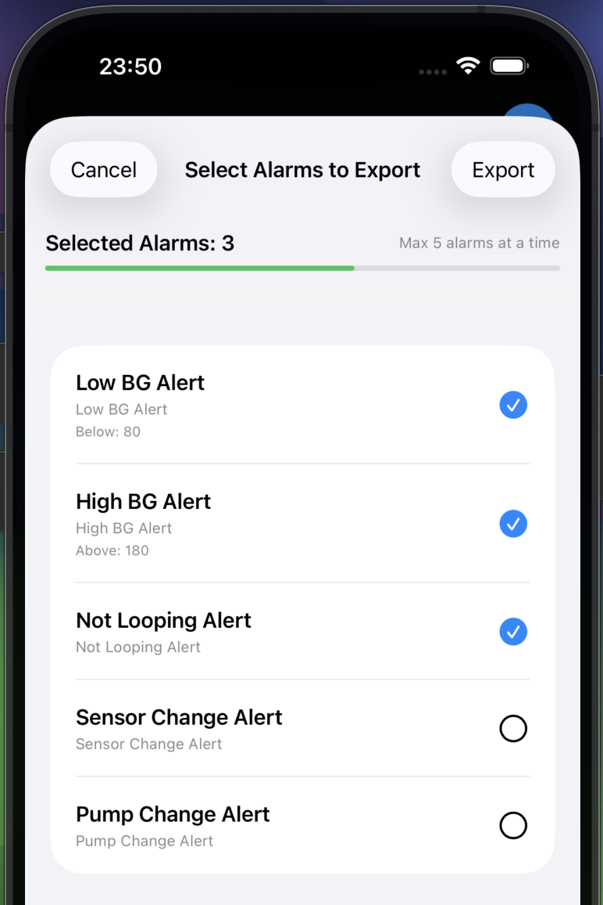
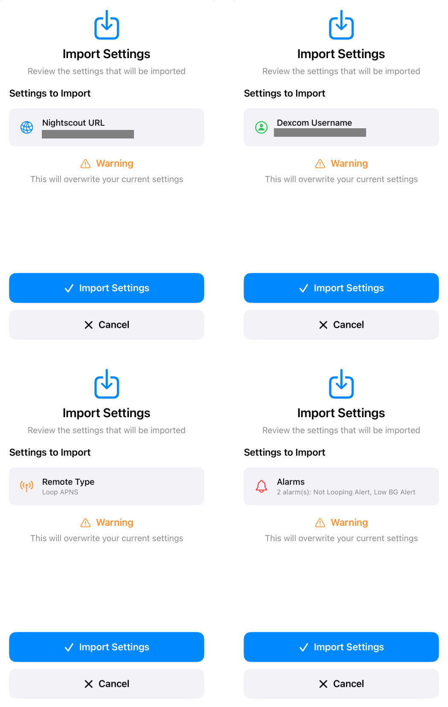

🚧 Documentation Under Construction 🚧

<!--todo-->
<!--Notes: be sure to add this info

-->

While this website is under construction, you can find missing information in three places:

* [*Loop and Learn* website: *LoopFollow* page](https://www.loopandlearn.org/loop-follow/)
* [LoopDocs website: Build Other Apps page](https://loopkit.github.io/loopdocs/browser/other-apps/)
* [Trio Docs: Loop Follow Remote Control Configuration page](https://triodocs.org/configuration/settings/features/remote-control/)

## Initial Configuration

After you build *LoopFollow* the first time, you are asked a few questions (your initial choices can always be modified later):

* **Calendar Access**: if you want to allow *LoopFollow* to provide real-time updates to carplay using the Calendar, choose **Allow Full Access**
* **Bluetooth Access**: if you want to use an expired Dexcom sensor or a spare RileyLink device to keep *LoopFollow* running in the background while your phone is locked, choose **Allow**
* **Notifications**: if you want *LoopFollow* to notify you for any of your alarms or if *LoopFollow* stops working, choose **Allow**

You will then be presented with a home screen as shown below.

{width="300"}
{align="center"}

### Setup Your Data Source

Tap on the "Setup Nightscout" button or "Setup Dexcom Share" button to enter your credentials for your preferred service.

Tap on the &hellip;&nbsp;More icon, at bottom right, and then choose Settings to get to the Settings screen.

!!! note "Tab Customization"
    With version 3.1 and newer, you can modify what icons show up in the tab bar. 
    
    If you prefer the Gear/Settings Icon (⚙️) in the tab bar, follow the directions in [Toolbar Tab Customization](lf-features.md#toolbar-tab-customization){: target="_blank" }.

- - -

### Settings Screen

The full lists of Settings is shown in the composite graphic below.

* The `Information Display Settings` and `Remote Settings` rows are only available with [Nightscout Credentials](#add-nightscout).

> {width="700"}
{align="center"}

### *LoopFollow* Data Source

> Make sure you have access to the internet when filling out credentials.

You provide *LoopFollow* with information about the person you are following. At least one of these must be entered:

* [*Nightscout* URL](#add-nightscout)
* [*Dexcom* Share credentials](#add-dexcom)

#### Add *Nightscout*

The graphic below shows the display when you tap on the *Nightscout* Settings row. For more information about tokens, keep reading the details below the graphic.

When adding the Nightscout information to monitor, you can copy your *Nightscout* URL (including the token) from the [Admin Tools in *Nightscout*](https://nightscout.github.io/nightscout/admin_tools/#subjects-and-roles). When pasted into *LoopFollow* URL row, the app will automatically extract and fill in both the URL and token.

!!! note "Setting up a second device"
    With version 4.3 and newer, You can set up a second device by scanning a QR code from another LoopFollow user. See this section [Import/Export Settings](#importexport-settings).

{width="300"}
{align="center"}

!!! tip "*Nightscout* Access"
    It is possible to have your *Nightscout* site readable by the world, in which case you do not need to add a token. If you choose to do that, just ignore references to entering the token. The status will show up as `OK (Read)`.

    For more information about tokens with *Nightscout*, refer to [Admin Tools in *Nightscout*](https://nightscout.github.io/nightscout/admin_tools/#subjects-and-roles).

The type of token depends on the type of remote control desired. 
The table below indicates the minimum token access for each type of remote control available with *LoopFollow*. 
When you enter your credentials, *LoopFollow* tries to reach the site and then provides the status. 

* The *Loop* Remote Control option requires *LoopFollow* version 3.2 or newer
* The *Trio* Remote Control option requires the user be on version 0.5.x or newer of Trio
    * **Breaking change** on 2025-October-06
    * *Trio* 0.6 or newer requires *LoopFollow* 4.0 or newer
    * *Trio* 0.5.1.28 or older requires *LoopFollow* 3.2.11 or older

| *LoopFollow* Remote Type | Minimum Token Access| *LoopFollow* Status |
|:--|:--|:--|
| **None** | Read | OK (Read) |
| ***Loop* Remote Control**| Read | OK (Read) |
| ***Trio* Remote Control**| Read | OK (Read) |
| ***Nightscout*** Trio 0.2 or older | Read & Careportal | OK (Read & Write) |

#### Add *Dexcom*

The graphic below shows the display when you tap on the *Dexcom* Settings row.

> The *Dexcom* Share credentials are optional, but can be useful when the *Nightscout* URL is unavailable.

!!! note "Setting up a second device"
    With version 4.3 and newer, You can set up a second device by scanning a QR code from another LoopFollow user. See this section [Import/Export Settings](#import-export-settings).

- - -

{width="300"}
{align="center"}

- - -

## The Toolbar

The toolbar (tab bar) at the bottom of the screen is now configurable for rapid access to the items of your choice. The items that can be selected are:

* [Home](#home)
* [Alarms](#alarms)
* Snoozer
* [Remote](#remote-settings)
* Nightscout
* Settings

See [Toolbar Tab Customization](lf-features.md#toolbar-tab-customization){: target="_blank" }

- - -

## Home

The home screen provides a dashboard of important information.  

* Supports Glucose display when Dexcom is available but Nightscout is not
* Supports Information Display from *Loop* and *Trio* when Nightscout URL is provided
    * *Loop* & *Trio*: common features like status, basal, bolus, carbs and eventual glucose forecast
    * *Loop*: *Loop* specific features like Profile Name, remote control
    * *Trio*: *Trio* specific features like Autosens, TDD, remote control (with *Trio* 0.5.x and newer)

Once you’ve configured your settings, your Main screen will look as beautiful as the example below!

{width="700"}
{align="center"}

- - -

## App Settings

🚧 Documentation Under Construction 🚧

### Background Refresh Settings

🚧 Documentation Under Construction 🚧

### General Settings

🚧 Documentation Under Construction 🚧

### Graph Settings Settings

🚧 Documentation Under Construction 🚧

### Tab Settings

The user can modify which icons are displayed in the task bar at the bottom of the screen.

See [Toolbar Tab Settings](lf-features.md#toolbar-tab-customization){: target="_blank" } for more information.

### Import/Export Settings

When setting up LoopFollow for another caregiver that will use some or all of the same configuration settings, you can export or scan a QR code to transfer settings between phones.

* Nightscout URL and token
* Dexcom Share Settings
* Remote Configuration Settings
* Alarms 

!!! important "QR Codes Contain Secret Information"
    Never share a QR code as a screenshot online or send it to someone that is not supposed to have access to your looper's information.
    
    In particular, only share a remote configuration QR code with a caregiver authorized and trained to send remote control commands to the looper's phone!
    
    If in doubt, you can revoke access to the APNS key at [https://developer.apple.com/account/resources/authkeys/list](https://developer.apple.com/account/resources/authkeys/list)

#### Export Settings

To export settings, select one of the options for

*  Export Nightscout Settings
*  Export Dexcom Share Settings
*  Export Remote Settings
*  Export Alarm Settings

{width="300"}
{align="center"}

Export Nightscout Settings, Export Dexcom Share Settings and Export Remote Settings will show a QR code directly that you can scan with the receiving phone.

Export Alarm Settings will let you select up to 5 alarms at a time to export. If you re-enter the export screen after a successful export, it will mark the exported alarms so that you can export more alarms if needed

{width="300"}
{width="300"}
{align="right"}

#### Import Settings

On the phone that will receive the settings from the QR code, choose the option:
"Scan QR Code to Import Settings"

The first time you import settings with LoopFollow, you will be required to give permission to use the camera. Once permission is granted, hold the importing phone to view the QR code presented by the exporting phone. 

When the QR code is accepted, you will see a screen indicating what type of settings is being imported. You will be warned that if you accept the import, your current settings will be overwritten.

> Note the QR code for alarms may be slow to import. Just move the phone closer and further away until the code is accepted.

{width="600"}
{align=center}

### Information Display Settings

🚧 Documentation Under Construction 🚧

#### `Rec. Bolus`

!!! warning "LoopFollow Report of Trio Recommended Dose"
    It happens. We made a mistake. In versions before 4.0, the `Rec. Bolus` feature displayed by *LoopFollow* was a value from the *Trio* app that was never meant to be used as a recommended bolus.

    But the mistake has been fixed and an appropriate `Rec. Bolus` is back.
    
    Make sure you have these version of code before using the recommended bolus. And pay attention to the warnings about how long since that recommendation was calculated by Trio.
    
    * LoopFollow 4.3 or newer
    * Trio 0.6.0.16 or newer
    
    **Remember: the `Rec. Bolus` value is from the last AID app update to Nightscout**
    

### Remote Settings

Detailed instructions for configuring a phone for remote control are found on the [Remote Control Overview](../remote/remote-control-overview.md){: target="_blank" } page.

If you are configuring a second device and already have one device configured for remote control, be sure to review:

* [Export Remote Settings with QR Code](../remote/remote-control-overview.md#export-remote-settings-with-qr-code){: target="_blank" }
* [Import from QR Code](../remote/remote-control-overview.md#import-from-qr-code){: target="_blank" }

### Alarms

🚧 Documentation Under Construction 🚧

### Alarm Settings

🚧 Documentation Under Construction 🚧

- - -

## Integrations

🚧 Documentation Under Construction 🚧

### Calendar

The calendar entry used to update on the watch in real time, but with iOS 18, the update rate has been throttled. 
It is still useful for Carplay.

### Contact

The Contact image trick added with v2.2.8 currently works to provide real-time updates on an Apple Watch.

For more detailed instructions, see [Real-Time Watch Updates using Contact](../)

- - -

## Advanced Settings

🚧 Documentation Under Construction 🚧

Allows you to choose what information to download from Nightscout and to modify your graph

* Download Treatments
* Download Prediction
* Graph Basal
* Graph Bolus
* Graph Carbs
* Graph Other Treatments
* BG Update Delay
* Logging options (turn on debug option)

- - -

## Logging

LoopFollow logs activity to a file that can be viewed within the app, and can be shared via email, a Notes file or Facebook messenger if needed.  The log can be filtered and searched. This will aid in troubleshooting and diagnostics. 
Normally, the debug log option is disabled. The log debug option is found in the Advanced Settings section. If the logs seem verbose, check that setting.

### View Log

🚧 Documentation Under Construction 🚧

### Share Logs

🚧 Documentation Under Construction 🚧

- - -

## *LoopFollow* Facebook Group

Tapping on this row takes you to the *LoopFollow* Facebook Group where you can review posts and ask for assistance.

- - -

## Build Information

This section reports the `Version` you are using, indicates the `Latest Version`. In addition, it reports when this app will expire, when it was build and provides details of the branch name and commit identifier.

