## Initial Configuration

After you build *LoopFollow* the first time, you are asked a few questions (your initial choices can always be modified later):

* **Calendar Access**: if you want to allow *LoopFollow* to provide real-time updates to carplay using the Calendar, choose **Allow Full Access**
* **Bluetooth Access**: if you want to use an expired Dexcom sensor or a spare RileyLink device to keep *LoopFollow* running in the background while your phone is locked, choose **Allow**
* **Notifications**: if you want *LoopFollow* to notify you for any of your alarms or if *LoopFollow* stops working, choose **Allow**

You will then be presented with a home screen as shown below. (Note with v5.0 and newer, the "More" icon is replaced with the "Menu" icon.)

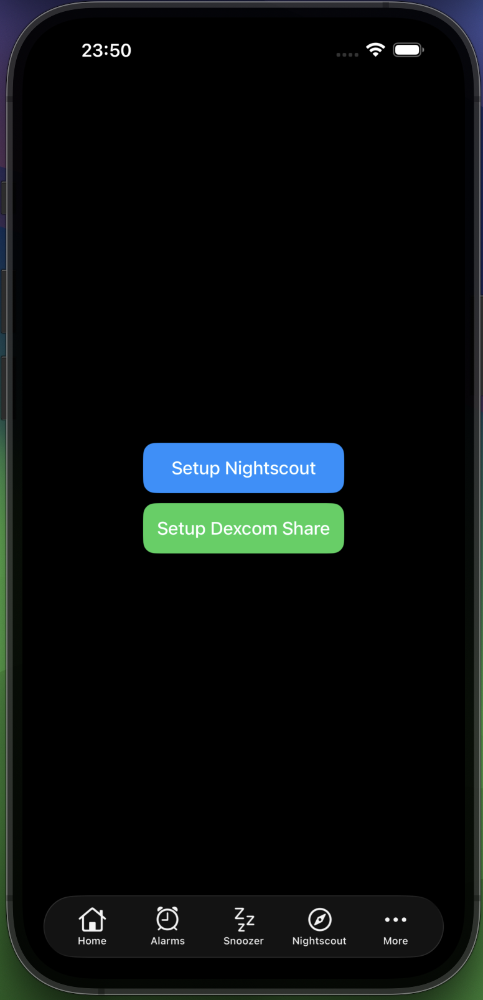{width="300"}
{align="center"}

### Setup Your Data Source

Tap on the "Setup Nightscout" button or "Setup Dexcom Share" button to enter your credentials for your preferred service.

For more information about how to configure your data source, refer to these sections:

* [Setup Nightscout](#setup-nightscout)
* [Setup Dexcom](#setup-dexcom)

Once a Data Source is entered, you have access to a variety of *LoopFollow* features.

The default settings are a fine place to start. As you learn to use *LoopFollow*, you can explore the adjustable Settings and Features.

- - -

## Home

The home screen provides a dashboard of important information.  

* Supports Glucose display when Dexcom is available but Nightscout is not
* Supports Information Display from *Loop* and *Trio* when Nightscout Site is provided
    * *Loop* & *Trio*: common features like status, basal, bolus, carbs and eventual glucose forecast
    * *Loop*: *Loop* specific features like Profile Name, remote control
    * *Trio*: *Trio* specific features like Autosens, TDD, remote control (with *Trio* 0.5.x and newer)

Once you’ve configured your settings, your Home screen will look as beautiful as the example below!

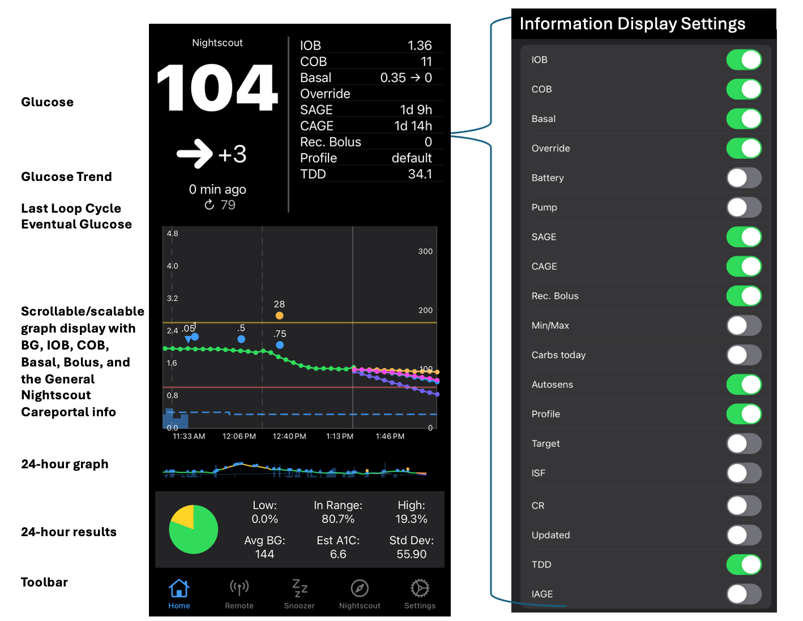{width="700"}
{align="center"}

- - -

## Toolbar

The toolbar (tab bar) at the bottom of the Home and Menu screens is configurable using [Settings: Tab](#tab) for rapid access to four features of your choice. The features that can be selected are:

| Name | Description |
|:--|:--|
| Home | Plots and summary display |
| Alarms | Select and configure Alarms |
| Remote | Send remote commands to OS-AID, requires Nightscout and secure configuration |
| Nightscout | Display your Nightscout Site |
| Snoozer | Allows quick "snooze" of alarms, great screen for night use or monitoring | 
| Treatments | Display Treatments, selectable by type |
| Statistics | Display Statistics for up to 90 days, requires Nightscout Site |

## Menu Screen

The following graphic shows the menu screen. The menu can always be reached using the right button of the toolbar on the Home and Menu screens.

* The features on this screen are described on the [*LoopFollowDocs* Features page](lf-features.md){: target="_blank" }
* Settings, Logging and Build Information are covered below
* [Support & Community](../index.md#community-support-and-build-help){: target="_blank" } are discussed on the *LoopFollowDocs* home page

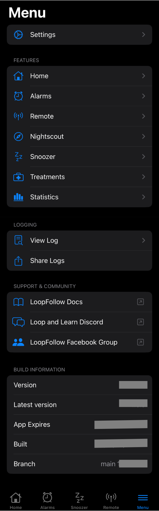{width=400}
{align="center"}

- - -

## Settings Screen

The Settings Screen is accessed by tapping on the Menu icon and selecting the Settings row.

* The `Information Display` and `Remote` rows are only available with [Nightscout Credentials](#setup-nightscout).

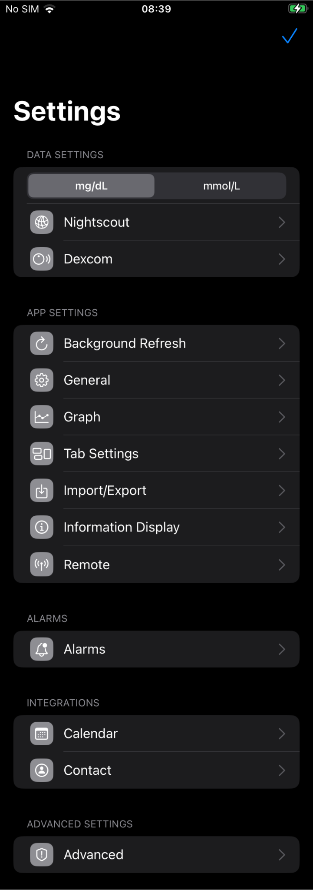{width="350"}
{align="center"}

### *LoopFollow* Data Source

> Make sure you have access to the internet when filling out credentials.

You provide *LoopFollow* with information about the person you are following. At least one of these must be entered:

* [*Nightscout* URL](#setup-nightscout)
* [*Dexcom* Share credentials](#setup-dexcom)

#### Setup *Nightscout*

The graphic below shows the display when you tap on the *Nightscout* row. For more information about tokens, keep reading the details below the graphic.

When adding the Nightscout information to monitor, you can copy your *Nightscout* URL (including the token) from the [Admin Tools in *Nightscout*](https://nightscout.github.io/nightscout/admin_tools/#subjects-and-roles). When pasted into *LoopFollow* URL row, the app will automatically extract and fill in both the URL and token.

!!! note "Setting up a second device"
    With version 4.3 and newer, You can set up a second device by scanning a QR code from another LoopFollow user. See this section [Import/Export](#importexport).

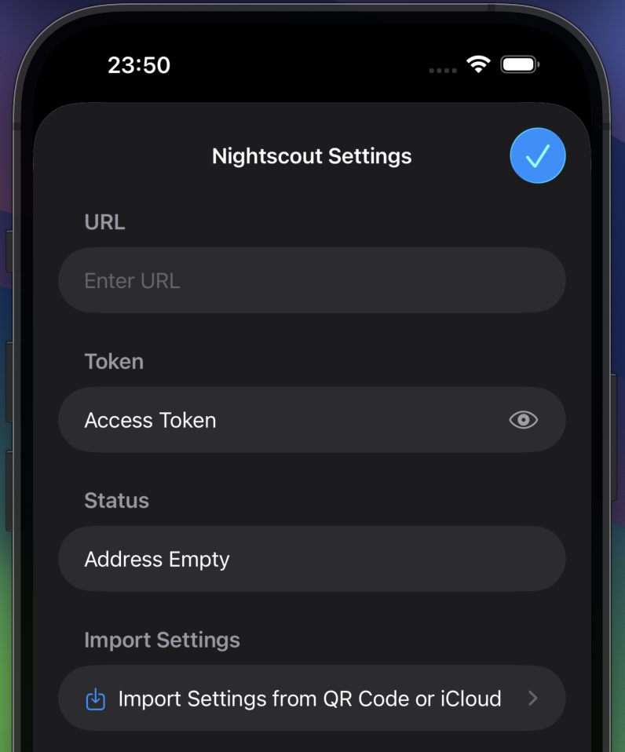{width="300"}
{align="center"}

!!! tip "*Nightscout* Access"
    It is possible to have your *Nightscout* site readable by the world, in which case you do not need to add a token. If you choose to do that, just ignore references to entering the token. The status will show up as `OK (Read)`.

    For more information about tokens with *Nightscout*, refer to [Admin Tools in *Nightscout*](https://nightscout.github.io/nightscout/admin_tools/#subjects-and-roles).

The type of token depends on the type of remote control desired. 
The table below indicates the minimum token access for each type of remote control available with *LoopFollow*. 
When you enter your credentials, *LoopFollow* tries to reach the site and then provides the status. 

* The *Loop* Remote Control option requires *LoopFollow* version 3.2 or newer
    * With LoopFollow 4.6 and later, the ability to get direct success or failure responses back to the LoopFollow phone is enhanced but requires Loop version 3.11.1 or newer
* The *Trio* Remote Control option requires the user be on version 0.5.x or newer of Trio
    * **Breaking change** on 2025-October-06
    * *Trio* 0.6 or newer requires *LoopFollow* 4.0 or newer
    * *Trio* 0.5.1.28 or older requires *LoopFollow* 3.2.11 or older

| *LoopFollow* Remote Type | Minimum Token Access| *LoopFollow* Status |
|:--|:--|:--|
| **None** | Read | OK (Read) |
| ***Loop* Remote Control**| Read | OK (Read) |
| ***Trio* Remote Control**| Read | OK (Read) |
| ***Nightscout*** Trio 0.2 or older | Read & Careportal | OK (Read & Write) |

#### Setup *Dexcom*

The graphic below shows the display when you tap on the *Dexcom* row.

> The *Dexcom* Share credentials are optional, but can be useful when the *Nightscout* URL is unavailable.

!!! note "Setting up a second device"
    With version 4.3 and newer, You can set up a second device by scanning a QR code from another LoopFollow user. See this section [Import/Export](#importexport).

- - -

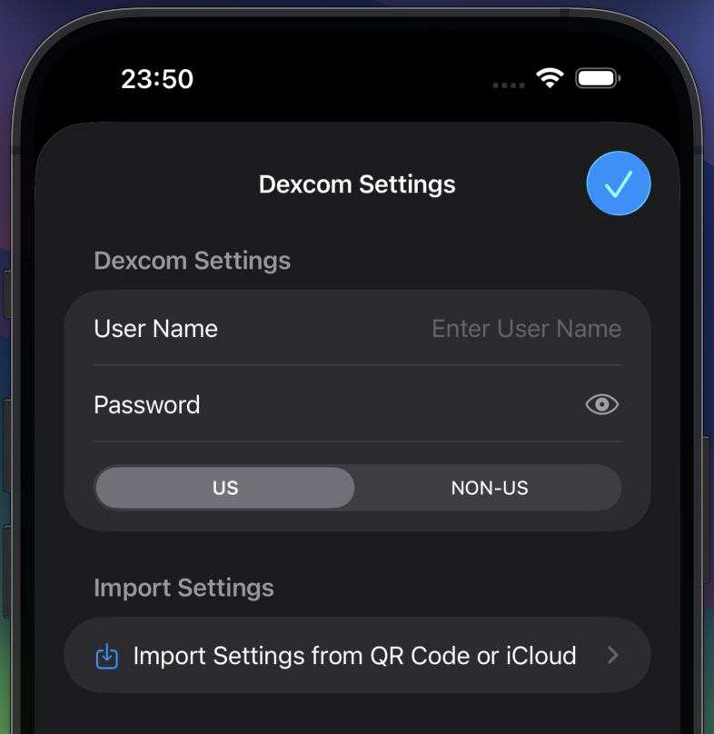{width="300"}
{align="center"}

- - -

### Display Settings

There are a number of display options the user can configure to customize the appearance of the plots, tables and navigation tabs. These are summarized in the table below along with quick links to a more detailed description.

* The `Information Display`row is only displayed with [Nightscout Credentials](#setup-nightscout).

| Name | Description | Link |
|:--|:--|:--|
| General | Adjust settings that affect the general app behavior | [General](#general) | 
| Graph | Adjust settings that affect the plots on the Home screen | [Graph](#graph) | 
| Information Display | Select which items to display in the Home screen IInformation Table Requires Nightscout Data Source | [Information Display](#information-display) | 
| Tab | Configure the toolbar displayed on the Home and Menu screens |[Tab](#tab) | 

- - -

### App Settings

There are a number of application settings the user can configure. These are summarized in the table below along with quick links to a more detailed description.

* The `Remote` row is only displayed with [Nightscout Credentials](#setup-nightscout).

| Name | Description | Link |
|:--|:--|:--|
| Background Refresh | Configure to keep *LoopFollow* always alive or allow it to sleep and thus conserve phone battery | [Background Refresh](lf-features.md#background-refresh){: target="_blank" } |
| Import/Export | Share configurations among Caregiver phones |[Import/Export](#importexport)| 
| Remote | Configure for secure remote control Requires Nightscout Data Source | [Remote Control Overview](../remote/remote-control-overview.md){: target="_blank" } 

## Settings Details

### General

These settings are accessed through the General row in the Settings screen.

| Name | Description |
|:--|:--|
| Display App Badge | When enabled - current glucose is displayed with app icon - select a Background Refresh option or badge will be stale. | 
| Persistent Notification | Typically disabled  When enabled, glucose is reported with every update |
| Appearance | Chose Light, Dark or System for appearance |
| Display Stats | When enabled, statistics for the last 24 hours are displayed on Home screen |
| Use IFCC A1C | When enabled, display estimated A1C using mmol/mol units |
| Display Small Graph | When enabled, a full history graph is displayed under the main plot. The history is determined by the Number of Days Back chosen in the Graph screen |
| Color BG Text | When enabled, use colors to highlight low, in-range and high values |
| Keep Screen Active | When enabled, override the auto-lock setting This works whether the phone is plugged in or not, so be sure to lock screen manually|
| Show Display Name | When enabled, the app name is shown on the Home screen Very useful if more than one person is being followed|
| Snoozer Emoji | When enabled, the snoozer screen shows emojis in addtion to glucose values |
| Force Portrait Mode | When enabled, aspect ratio is not affected by phone postion |
| Time Zone Override | When enabled, another row is displayed Select the time zone for the T1D who is being followed |
| Speak BG | When enabled, glucose is spoken aloud in selected language Options are available to limit this but see also Persistent Notification |

### Graph

These settings are accessed through the Graph row in the Settings screen.

| Name | Description |
|:--|:--|
| Display Dots | Enable or Disable |
| Display Lines | Enable or Disable |
| Show DIA Lines | Enable or Disable |
| Show -30 min Line | Enable or Disable, with respect to carb entry |
| Show -90 min Line | Enable or Disable, with respect to carb entry |
| Show Midnight Lines | Enable or Disable |
| Show Calibration | Enable or Disable |
| Show Carb Aborption | Enable or Disable |
| Treatments on Small Graph | Enable or Disable |
| Height | Select height of small Graph |
| Hours of Prediction | Select prediction extent on main plot |
| Min Basal | clamp the minimum displayed range for basal rate plot |
| Min BG Scale | clamp the minimum displayed range for glucose scale |
| Low BG Line | Choose glucose level to display as low |
| High BG Line | Choose glucose level to display as high |
| Show Days Back | Affects the small graph display and adjusts fetch from Nightscout Site |

### Information Display

These items can be chosen for display on the Home screen. A Nightscout Site is required and must be accessible or the table is blank. 

> A lower case `loop` is used to denote a `closed-loop` cycle for both `Trio` and `Loop`.

!!! note ""
    The order of rows in the Settings: Information Display screen is reflected in the Information Table on your Home screen.
    
    * The order in the table below is the order in the LoopFollow code
    * You can drag the rows up and down to suit your preferred order

| Name | Description | `Loop` / `Trio` / Both |
|:--|:--|:-:|
| IOB | Active Insulin, also known as Insulin on Board | Both |
| COB | Active Carbohydrates, also known as Carbs on Board | Both |
| Basal | Current Basal Rate running on the pump | Both |
| Override | Sensitivity (if not 100%) and Target (for `Loop`)  Name (for `Trio`)| Both |
| Battery | Battery level on the OS-AID Phone Trid indicates if currently plugged in | Both |
| Pump | Reservoir Level | Both |
| Pump Battery | Battery level on pumps that report levels | Both |
| SAGE | Sensor Age | Both |
| CAGE | Cannula Age | Both |
| Rec. Bolus | Recommended bolus from last `loop` | Both |
| Min/Max | Minimum and maximum values for glucose from current OS-AID forecast | Both |
| Carbs today | Total grams of Carbs since Midnight | Both |
| Autosens | `Trio`: autosens value | `Trio` |
| Profile | Named Profile `Loop` requires Profile Customization | Both |
| Target | Correction Range used by OS-AID | Both |
| ISF | Insulin Sensitivity Factor in therapy settings with modification if appropriate | Both |
| CR | Carbohydrate Ratio in therapy settings with modification if appropriate | Both |
| Updated | Time of last `loop` | `Trio` |
| TDD | Total Daily Dose in the last 24 hours | ``Trio`` |
| IAGE | Insulin Age | Both |

### Tab

The user can modify which icons are displayed in the task bar at the bottom of the screen.

In the Settings screen, select Tab. Drag any of the options up or down to your preferred configuration.

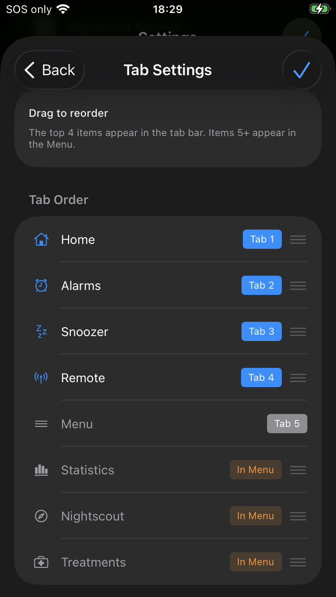{width=400}
{align="center"}

### Import/Export

When setting up LoopFollow for another caregiver that will use some or all of the same configuration settings, you can export or scan a QR code to transfer settings between phones.

* Nightscout Site and token
* Dexcom Share
* Remote Configuration
* Alarms 

!!! important "QR Codes Contain Secret Information"
    Never share a QR code as a screenshot online or send it to someone that is not supposed to have access to your looper's information.
    
    In particular, only share a remote configuration QR code with a caregiver authorized and trained to send remote control commands to the looper's phone!
    
    If in doubt, you can revoke access to the APNS key at [https://developer.apple.com/account/resources/authkeys/list](https://developer.apple.com/account/resources/authkeys/list)

#### Export Settings

To export settings, select one of the options for

*  Export Nightscout Settings
*  Export Dexcom Share Settings
*  Export Remote Settings
*  Export Alarm Settings

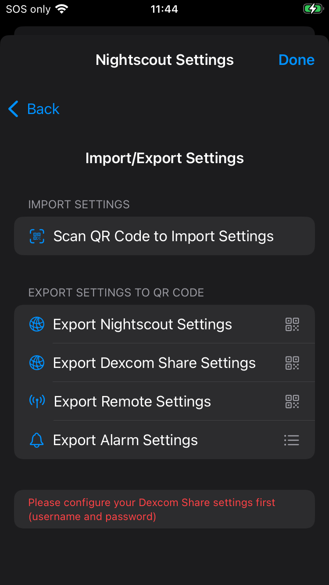{width="300"}
{align="center"}

Export Nightscout Settings, Export Dexcom Share Settings and Export Remote Settings will show a QR code directly that you can scan with the receiving phone.

Export Alarm Settings will let you select up to 5 alarms at a time to export. If you re-enter the export screen after a successful export, it will mark the exported alarms so that you can export more alarms if needed

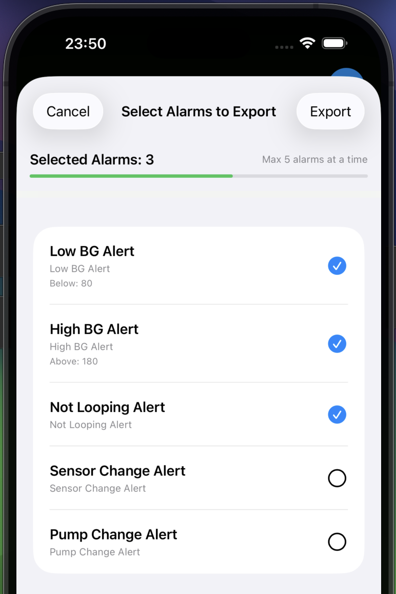{width="300"}
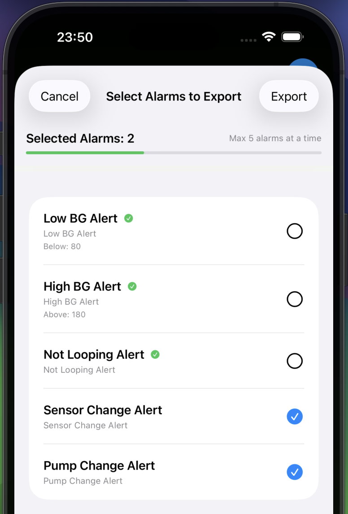{width="300"}
{align="right"}

#### Import Settings

On the phone that will receive the settings from the QR code, choose the option:
"Scan QR Code to Import Settings"

The first time you import settings with LoopFollow, you will be required to give permission to use the camera. Once permission is granted, hold the importing phone to view the QR code presented by the exporting phone. 

When the QR code is accepted, you will see a screen indicating what type of settings is being imported. You will be warned that if you accept the import, your current settings will be overwritten.

> Note the QR code for alarms may be slow to import. Just move the phone closer and further away until the code is accepted.

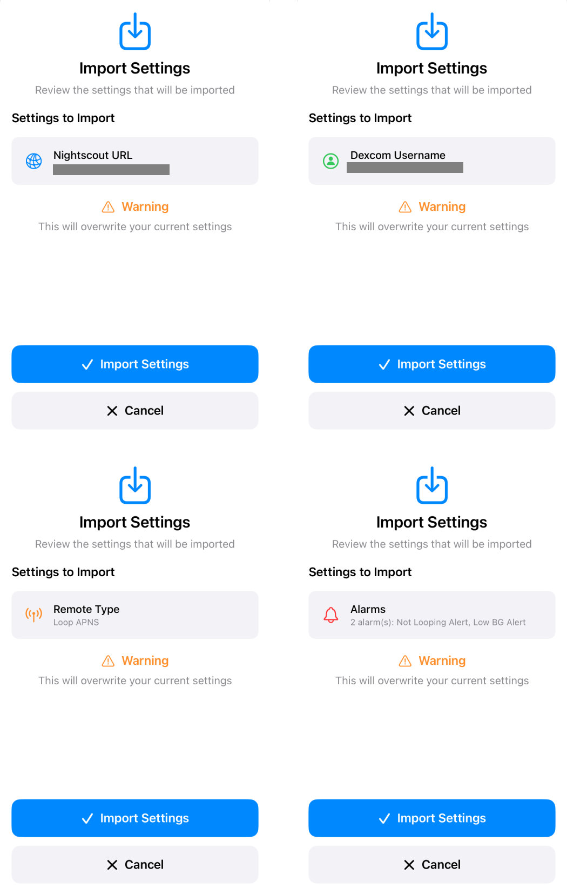{width="600"}
{align=center}

### Remote

Detailed instructions for configuring a phone for remote control are found on the [Remote Control Overview](../remote/remote-control-overview.md){: target="_blank" } page.

If you are configuring a second device and already have one device configured for remote control, be sure to review:

* [Export Remote Settings with QR Code](../remote/remote-control-overview.md#export-remote-settings-with-qr-code){: target="_blank" }
* [Import from QR Code](../remote/remote-control-overview.md#import-from-qr-code){: target="_blank" }

### Alarms

The Alarms settings allow you to control the behavior of all active alarms. Individual alarms are selected and configured with the [Alarms Feature](lf-features.md#alarms).

* One nice feature you may want to enable is the Volume Buttons Snooze Alarms option.

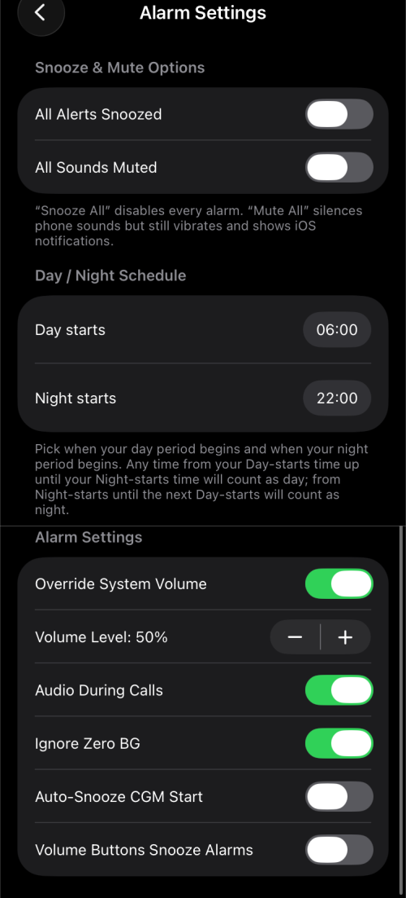{width="350"}
{align="center"}

### Calendar

The calendar entry used to update on the watch in real time, but with iOS 18, the update rate has been throttled. 
It is still useful for Carplay.

### Contact

The Contact image trick added with v2.2.8 currently works to provide real-time updates on an Apple Watch.

For more detailed instructions, see [Real-Time Watch Updates using Contact](lf-features.md#real-time-watch-updates-using-contact){: target="_blank" }

- - -

### Advanced

Allows you to choose what information to download from Nightscout and to modify your graph

* Download Treatments
* Download Prediction
* Graph Basal
* Graph Bolus
* Graph Carbs
* Graph Other Treatments
* BG Update Delay
* Logging options (turn on debug option)

- - -

## Logging

LoopFollow logs activity to a file that can be viewed within the app, and can be shared via email, a Notes file or Facebook messenger if needed.  The log can be filtered and searched. This will aid in troubleshooting and diagnostics. 

Normally, the debug log option is disabled. The log debug option is found in the Advanced section. If the logs seem verbose, check that setting.

### View Log

When you select View Log, you see the entire log but can also filter for particular types of activities.

### Share Logs

When you choose Share Logs, you can send the log to device or app of your choice.

The log is named `LoopFollow YYYY-MM-DD`.

- - -

## Build Information

This section reports the `Version` you are using, indicates the `Latest Version`. In addition, it reports when this app will expire, when it was build and provides details of the branch name and commit identifier.

