## Initial Configuration

After you build *LoopFollow* the first time, you are asked a few questions (your initial choices can always be modified later):

* **Calendar Access**: if you want to allow *LoopFollow* to provide real-time updates to carplay using the Calendar, choose **Allow Full Access**
* **Bluetooth Access**: if you want to use an expired Dexcom sensor or a spare RileyLink device to keep *LoopFollow* running in the background while your phone is locked, choose **Allow**
* **Notifications**: if you want *LoopFollow* to notify you for any of your alarms or if *LoopFollow* stops working, choose **Allow**

You will then be presented with a home screen as shown below.

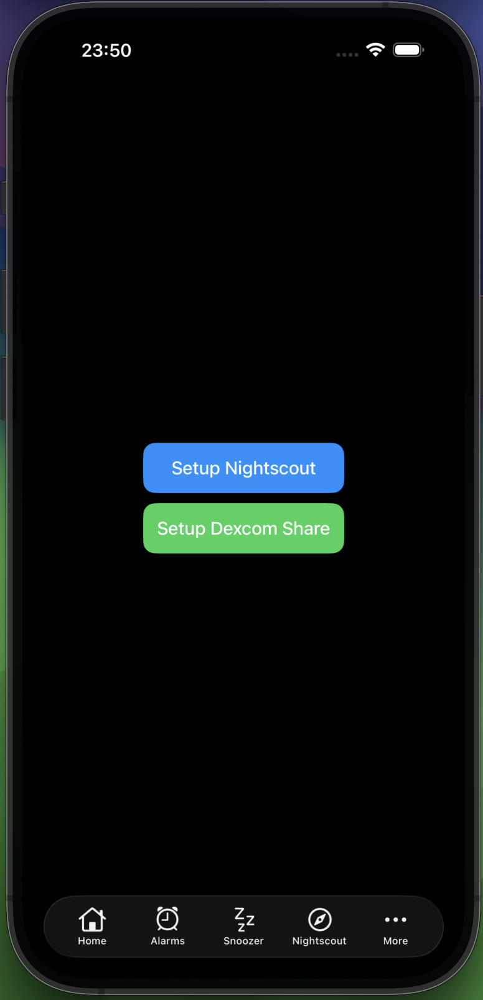{width="300"}
{align="center"}

### Setup Your Data Source

Tap on the "Setup Nightscout" button or "Setup Dexcom Share" button to enter your credentials for your preferred service.

For more information about how to configure your data source, refer to these sections:

* [Setup Nightscout](#setup-nightscout)
* [Setup Dexcom](#setup-dexcom)

Once a Data Source is entered, you have access to a variety of *LoopFollow* features.

The default settings are a fine place to start. As you learn to use *LoopFollow*, you can explore the adjustable Settings and Features.

- - -

## Home

The home screen provides a dashboard of important information.  

* Supports Glucose display when Dexcom is available but Nightscout is not
* Supports Information Display from *Loop* and *Trio* when Nightscout Site is provided
    * *Loop* & *Trio*: common features like status, basal, bolus, carbs and eventual glucose forecast
    * *Loop*: *Loop* specific features like Profile Name, remote control
    * *Trio*: *Trio* specific features like Autosens, TDD, remote control

Once you’ve configured your settings, your Home screen will look as beautiful as the example below!

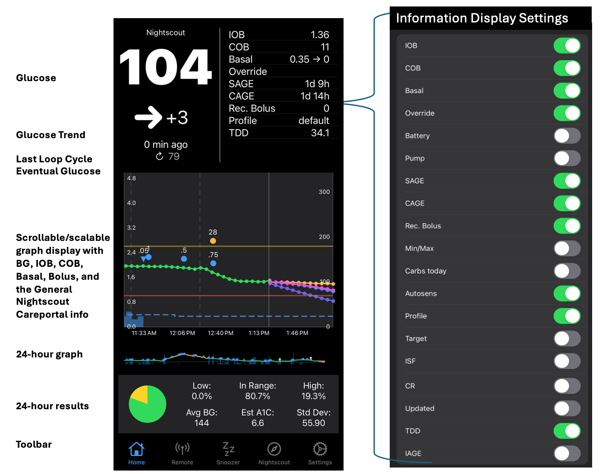{width="700"}
{align="center"}

- - -

## Toolbar

The toolbar (tab bar) at the bottom of the Home and Menu screens is configurable using [Settings: Tabs](#tabs). Four icons are displayed at a time — choose from the options below. The features that can be selected are:

| Name | Description |
|:--|:--|
| Home | Plots and summary display |
| Alarms | Select and configure Alarms |
| Remote | Send remote commands to an OS-AID app (*Loop* or *Trio*), requires Nightscout and secure configuration |
| Nightscout | Display your Nightscout Site |
| Snoozer | Allows quick "snooze" of alarms, great screen for night use or monitoring | 
| Treatments | Display Treatments, selectable by type |
| Statistics | Display Statistics for up to 90 days, requires Nightscout Site |

## Menu Screen

The following graphic shows the menu screen. The menu can always be reached using the right button of the toolbar on the Home and Menu screens.

* The features on this screen are described on the [*LoopFollowDocs* Features page](lf-features.md){: target="_blank" }
* Settings, Logging and Build Information are covered below
* [Support & Community](../index.md#community-support-and-build-help){: target="_blank" } are discussed on the *LoopFollowDocs* home page

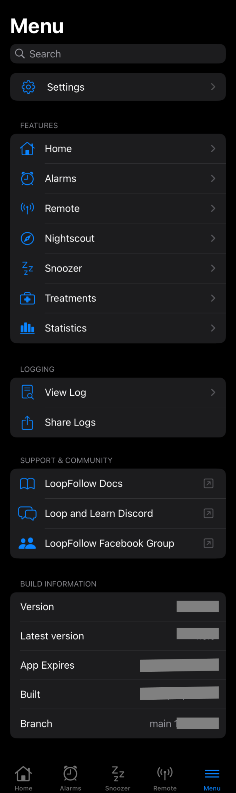{width=400}
{align="center"}

- - -

## Settings Screen

The Settings Screen is accessed by tapping on the Menu icon and selecting the Settings row.

* The `Information Display` and `Remote` rows are only available with [Nightscout Credentials](#setup-nightscout).

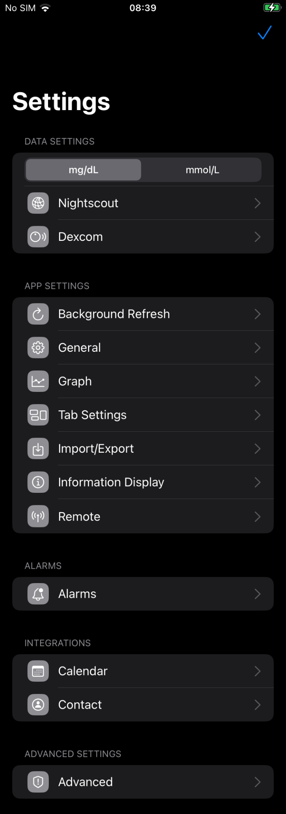{width="350"}
{align="center"}

### *LoopFollow* Data Source

> Make sure you have access to the internet when filling out credentials.

You provide *LoopFollow* with information about the person you are following. At least one of these must be entered:

* [*Nightscout* URL](#setup-nightscout)
* [*Dexcom* Share credentials](#setup-dexcom)

#### Setup *Nightscout*

The graphic below shows the display when you tap on the *Nightscout* row. For more information about tokens, keep reading the details below the graphic.

When adding the Nightscout information to monitor, you can copy your *Nightscout* URL (including the token) from the [Admin Tools in *Nightscout*](https://nightscout.github.io/nightscout/admin_tools/#subjects-and-roles). When pasted into *LoopFollow* URL row, the app will automatically extract and fill in both the URL and token.

!!! note "Setting up a second device"
    With version 4.3 and newer, you can set up a second device by scanning a QR code from another LoopFollow user. See this section [Import/Export](#importexport).

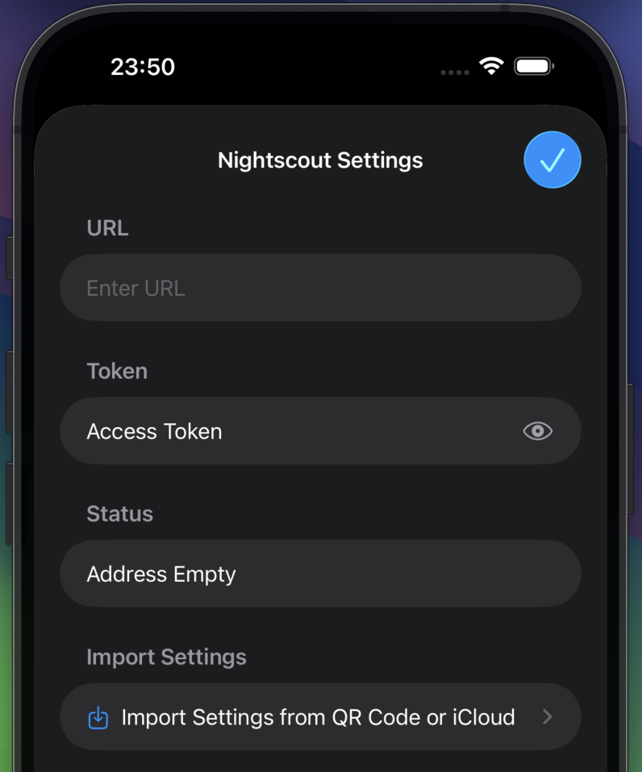{width="300"}
{align="center"}

!!! tip "*Nightscout* Access"
    It is possible to have your *Nightscout* site readable by the world, in which case you do not need to add a token. If you choose to do that, just ignore references to entering the token. The status will show up as `OK (Read)`.

    For more information about tokens with *Nightscout*, refer to [Admin Tools in *Nightscout*](https://nightscout.github.io/nightscout/admin_tools/#subjects-and-roles).

If your Nightscout site is protected, which is recommended, you need to create a **readable** token to use with *LoopFollow*.
When you enter your credentials, *LoopFollow* tries to reach the site and then provides the status. 

For a full summary of version requirements for *Loop* and *Trio* remote control, see [Version Compatibility](../faqs/lf-history.md#version-compatibility){: target="_blank" }.

| *LoopFollow* Remote Type | Minimum Token Access| *LoopFollow* Status |
|:--|:--|:--|
| **None** | Read | OK (Read) |
| ***Loop* Remote Control**| Read | OK (Read) |
| ***Trio* Remote Control**| Read | OK (Read) |

##### WebSocket

Below the URL and Token rows, the *Nightscout* setup screen has an **Enable WebSocket** toggle. When enabled, *LoopFollow* opens a live connection to your *Nightscout* server while the app is in the foreground, so new readings, treatments, and device status arrive within seconds of being posted to *Nightscout* — close to real-time. The status row underneath the toggle shows whether the connection is *Connecting…*, *Connected*, *Disconnected*, or in *Error*.

When *LoopFollow* moves to the background, the WebSocket disconnects and the app falls back to its normal scheduled polling so the persistent connection doesn't drain the battery. The connection is re-established automatically when you return to the app. If the connection drops while you are still in the foreground, normal polling resumes immediately as a safety net.

#### Setup *Dexcom*

The graphic below shows the display when you tap on the *Dexcom* row.

> The *Dexcom* Share credentials are optional, but can be useful when the *Nightscout* URL is unavailable.

!!! note "Setting up a second device"
    With version 4.3 and newer, you can set up a second device by scanning a QR code from another LoopFollow user. See this section [Import/Export](#importexport).

- - -

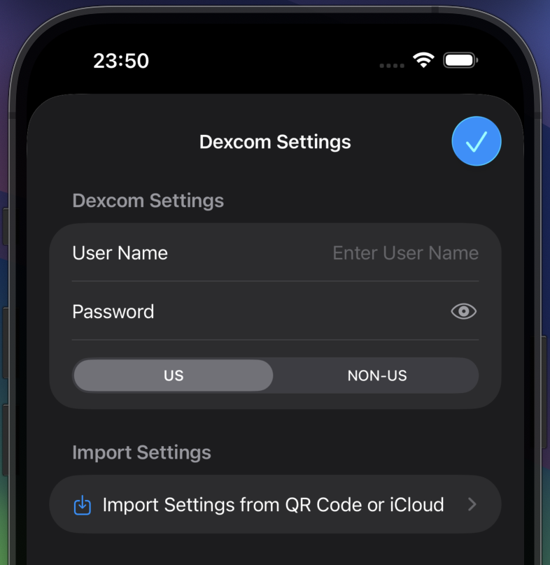{width="300"}
{align="center"}

- - -

### Display Settings

There are a number of display options the user can configure to customize the appearance of the plots, tables and navigation tabs. These are summarized in the table below along with quick links to a more detailed description.

* The `Information Display` row is only displayed with [Nightscout Credentials](#setup-nightscout).

| Name | Description | Link |
|:--|:--|:--|
| General | Adjust settings that affect the general app behavior | [General](#general) | 
| Graph | Adjust settings that affect the plots on the Home screen | [Graph](#graph) | 
| Information Display | Select which items to display in the Home screen Information Table Requires Nightscout Data Source | [Information Display](#information-display) |
| Units and Metrics | Choose glucose unit, Time in Range mode, and how glycemic and variability metrics are reported | [Units and Metrics](#units-and-metrics) |
| Tabs | Configure the toolbar displayed on the Home and Menu screens |[Tabs](#tabs) | 

### App Settings

There are a number of application settings the user can configure. These are summarized in the table below along with quick links to a more detailed description.

* The `Remote` row is only displayed with [Nightscout Credentials](#setup-nightscout).

| Name | Description | Link |
|:--|:--|:--|
| Background Refresh | Configure to keep *LoopFollow* always alive or allow it to sleep and thus conserve phone battery | [Background Refresh](lf-features.md#background-refresh){: target="_blank" } |
| Import/Export | Share configurations among Caregiver phones | [Import/Export](#importexport) |
| APN | Enter Apple Push Notification Credentials for Remote Control and Live Activity | [APN](#apn)|
| Live Activity | Enable and Configure Live Activity | [Live Activity](#live-activity) |
| Remote | Configure for secure remote control Requires Nightscout Data Source | [Remote Control Overview](../remote/remote-control-overview.md){: target="_blank" } |

### Other Settings

There are a few more sections on the Settings screen. These are summarized in the table below along with quick links to a more detailed description.

| Name | Description | Link |
|:--|:--|:--|
| Alarms | Control overall alarm behavior; individual alarms are configured in the Alarms feature | [Alarms](#alarms) |
| Calendar | Configure calendar updates for CarPlay | [Calendar](#calendar) |
| Contact | Configure real-time glucose updates on Apple Watch | [Contact](#contact) |
| Advanced | Control which data is downloaded from Nightscout and adjust graph options | [Advanced](#advanced) |

- - -

## Settings Details

### General

These settings are accessed through the General row in the Settings screen.

| Name | Description |
|:--|:--|
| Display App Badge | When enabled - current glucose is displayed with app icon - select a Background Refresh option or badge will be stale. | 
| Persistent Notification | Typically disabled  When enabled, glucose is reported with every update |
| Appearance | Choose Light, Dark or System for appearance |
| Display Stats | When enabled, statistics for the last 24 hours are displayed on Home screen |
| Display Small Graph | When enabled, a full history graph is displayed under the main plot. The history is determined by the Number of Days Back chosen in the Graph screen |
| Color BG Text | When enabled, use colors to highlight low, in-range and high values |
| Keep Screen Active | When enabled, override the auto-lock setting This works whether the phone is plugged in or not, so be sure to lock screen manually|
| Show Display Name | When enabled, the app name is shown on the Home screen Very useful if more than one person is being followed|
| Snoozer Emoji | When enabled, the snoozer screen shows emojis in addition to glucose values |
| Force Portrait Mode | When enabled, aspect ratio is not affected by phone orientation |
| Time Zone Override | When enabled, another row is displayed Select the time zone for the T1D who is being followed |
| Speak BG | When enabled, glucose is spoken aloud in selected language Options are available to limit this but see also Persistent Notification |

### Graph

These settings are accessed through the Graph row in the Settings screen.

| Name | Description |
|:--|:--|
| Display Dots | Enable or Disable |
| Display Lines | Enable or Disable |
| Show DIA Lines | Enable or Disable |
| Show -30 min Line | Enable or Disable, with respect to carb entry |
| Show -90 min Line | Enable or Disable, with respect to carb entry |
| Show Midnight Lines | Enable or Disable |
| Show Calibration | Enable or Disable |
| Show Carb Absorption | Enable or Disable |
| Show Yesterday's BG | When enabled, yesterday's glucose is overlaid on the main graph as a dimmed gray line, time-shifted 24 hours so it aligns with the same clock time today, for visual comparison *Nightscout* only (Dexcom Share does not return enough history); default off |
| Treatments on Small Graph | Enable or Disable |
| Height | Select height of small Graph |
| Hours of Prediction | Select prediction extent on main plot |
| Min Basal | clamp the minimum displayed range for basal rate plot |
| Min BG Scale | clamp the minimum displayed range for glucose scale |
| Show Days Back | Affects the small graph display and adjusts fetch from Nightscout Site |

### Information Display

These items can be chosen for display on the Home screen. A Nightscout Site is required and must be accessible or the table is blank. 

> A lower case `loop` is used to denote a `closed-loop` cycle for both `Trio` and `Loop`.

!!! note ""
    The order of rows in the Settings: Information Display screen is reflected in the Information Table on your Home screen.
    
    * The order in the table below is the order in the LoopFollow code
    * You can drag the rows up and down to suit your preferred order
    * Tap a row to open its detail, where you set its visibility and, for supported rows, [color thresholds](#color-thresholds)

| Name | Description | `Loop` / `Trio` / Both |
|:--|:--|:-:|
| IOB | Active Insulin, also known as Insulin on Board | Both |
| COB | Active Carbohydrates, also known as Carbs on Board | Both |
| Basal | Current Basal Rate running on the pump | Both |
| Override | Sensitivity (if not 100%) and Target (for `Loop`)  Name (for `Trio`)| Both |
| Battery | Battery level on the OS-AID Phone *Trio* indicates if currently plugged in | Both |
| Pump | Reservoir Level | Both |
| Pump Battery | Battery level on pumps that report levels | Both |
| SAGE | Sensor Age | Both |
| CAGE | Cannula Age | Both |
| Rec. Bolus | Recommended bolus from last `loop` | Both |
| Min/Max | Minimum and maximum values for glucose from current OS-AID forecast | Both |
| Carbs today | Total grams of Carbs since Midnight | Both |
| Autosens | `Trio`: autosens value | `Trio` |
| Profile | Named Profile `Loop` requires Profile Customization | Both |
| Target | Correction Range used by OS-AID | Both |
| ISF | Insulin Sensitivity Factor in therapy settings with modification if appropriate | Both |
| CR | Carbohydrate Ratio in therapy settings with modification if appropriate | Both |
| Updated | Time of last `loop` | `Trio` |
| TDD | Total Daily Dose in the last 24 hours | `Trio` |
| IAGE | Insulin Age | Both |

#### Color Thresholds

Rows that show a single number can optionally turn **yellow** or **red** when their value crosses a threshold you set. This is a purely visual cue — it never triggers an alarm. Values that are in range stay green.

To set them up, open a row's detail from the Information Display screen, turn on **Coloring**, and set the **Yellow at** and **Red at** thresholds. Each supported row starts with sensible defaults you can adjust.

The "concerning" direction is fixed per row: battery and reservoir rows color when the value is **low**, while insulin/carb load and the age rows color when the value is **high**. *LoopFollow* keeps the Red threshold on the correct side of Yellow for that direction.

Rows that support color thresholds:

| Row | Colors when | Default Yellow / Red |
|:--|:-:|:--|
| IOB | high | 3 / 5 U |
| COB | high | 30 / 60 g |
| Battery (phone) | low | 30 / 15 % |
| Pump Battery | low | 30 / 15 % |
| Pump (reservoir) | low | 20 / 10 U |
| TDD | high | 60 / 80 U |
| Rec. Bolus | high | 1 / 2 U |
| Carbs today | high | 150 / 250 g |
| SAGE (sensor age) | high | 9 / 9.5 days |
| CAGE (cannula age) | high | 2.5 / 3 days |
| IAGE (insulin age) | high | 2.5 / 3 days |

### Units and Metrics

These settings are accessed through the *Units and Metrics* row in the Settings screen. They control how glucose is displayed throughout the app, the range used for Time in Range, and how long-term glycemic and variability metrics are reported.

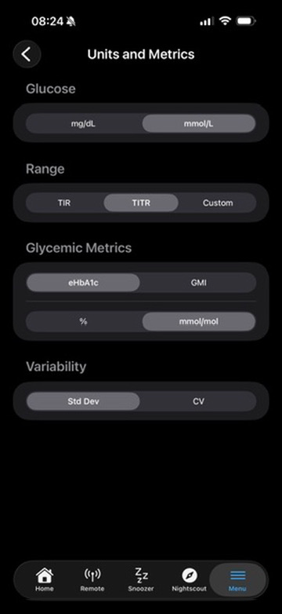{width="300"}
{align="center"}

#### Glucose

Selects the unit used everywhere in *LoopFollow* for glucose values, target ranges and graphs.

| Option | Example reading |
|:--|:--|
| `mg/dL` | `120 mg/dL` |
| `mmol/L` | `6.7 mmol/L` |

The same reading is shown in either unit — switching the unit does not change any underlying data.

#### Range

Selects the Low and High thresholds that define your target interval. The percentage of readings within this interval is shown on the Home screen.

| Option   | Name                  | Low – High                          |
|:--|:--|:--|
| `TIR`    | Time in Range         | 70 – 180 mg/dL (3.9 – 10.0 mmol/L)  |
| `TITR`   | Time in Tighter Range | 70 – 140 mg/dL (3.9 – 7.8 mmol/L)   |
| `Custom` | —                     | Values you enter below              |

When `Custom` is selected, two extra rows appear — **Low** and **High** — entered in the glucose unit you chose above. These same Low and High values also drive the Low and High BG lines drawn on the main graph.

#### Glycemic Metrics

A long-term estimate of average glycemia, computed from the average glucose for the displayed period.

| Metric | What it is |
|:--|:--|
| `eHbA1c` | Estimated HbA1c, derived from average glucose using the ADAG-style formula |
| `GMI`    | Glucose Management Indicator, derived from average CGM glucose |

Either metric can be reported in:

* `%` — for example `7.0 %`
* `mmol/mol` — for example `53 mmol/mol`

Example values for three different average glucose levels:

| Mean glucose | eHbA1c (%) | GMI (%) | eHbA1c (mmol/mol) | GMI (mmol/mol) |
|:--|:--|:--|:--|:--|
| 120 mg/dL  /  6.7 mmol/L | 5.8 | 6.2 | 40 | 44 |
| 154 mg/dL  /  8.6 mmol/L | 7.0 | 7.0 | 53 | 53 |
| 180 mg/dL  / 10.0 mmol/L | 7.9 | 7.6 | 63 | 60 |

#### Variability

Selects how variability of glucose is reported.

| Option | What it is | Example |
|:--|:--|:--|
| `Std Dev` | Standard deviation of glucose, in the selected glucose unit | `40 mg/dL` or `2.2 mmol/L` |
| `CV`      | Coefficient of Variation — standard deviation divided by mean glucose, expressed as a percent | `35 %` |

CV is reported as a percentage and is independent of the glucose unit.

### Tabs

The user can modify which icons are displayed in the tab bar at the bottom of the screen.

In the Settings screen, select Tabs. Drag any of the options up or down to your preferred configuration.

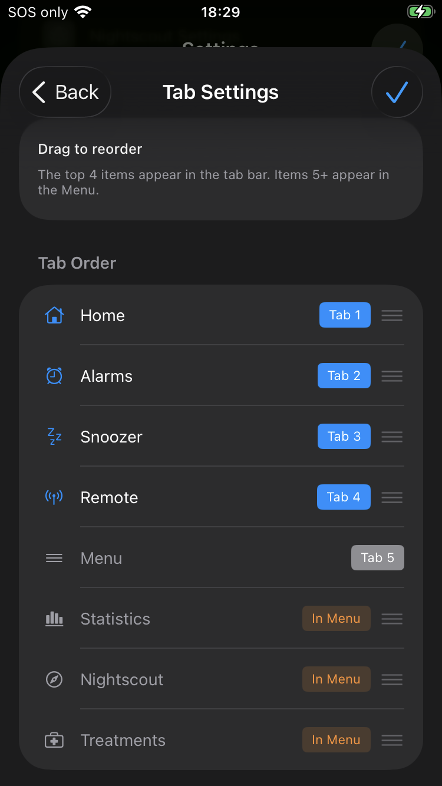{width=400}
{align="center"}

### Background Refresh

There are several options for keeping *LoopFollow* up to date. If you rely on *LoopFollow* Alarms or Live Activity, you must configure a Background Refresh setting.

For more information, see [Background Refresh](lf-features.md#background-refresh){: target="_blank" }.

### Import/Export

When setting up LoopFollow for another caregiver that will use some or all of the same configuration settings, you can export or scan a QR code to transfer settings between phones.

* Nightscout Site and token
* Dexcom Share
* Remote Configuration
* Alarms 

!!! important "QR Codes Contain Secret Information"
    Never share a QR code as a screenshot online or send it to someone that is not supposed to have access to your looper's information.
    
    In particular, only share a remote configuration QR code with a caregiver authorized and trained to send remote control commands to the looper's phone!
    
    If in doubt, you can revoke access to the APNS key at [https://developer.apple.com/account/resources/authkeys/list](https://developer.apple.com/account/resources/authkeys/list)

#### Export Settings

To export settings, select one of the options for

*  Export Nightscout Settings
*  Export Dexcom Share Settings
*  Export Remote Settings
*  Export Alarm Settings

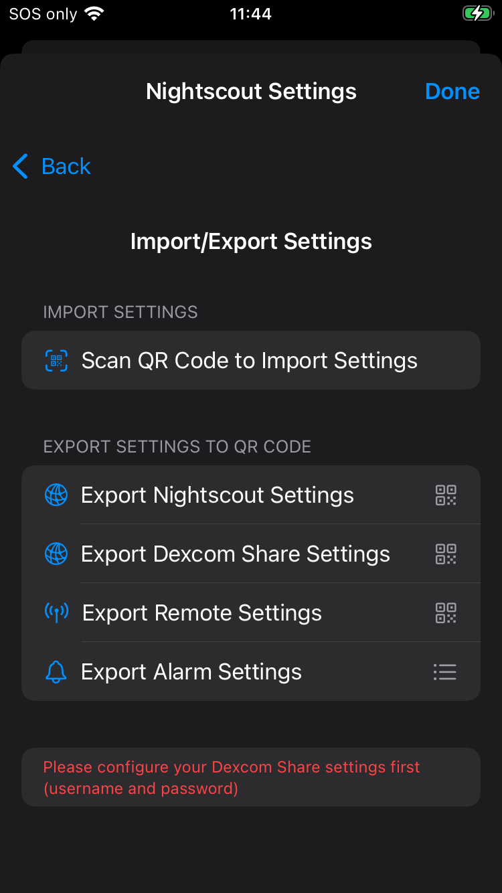{width="300"}
{align="center"}

Export Nightscout Settings, Export Dexcom Share Settings and Export Remote Settings will show a QR code directly that you can scan with the receiving phone.

Export Alarm Settings will let you select up to 5 alarms at a time to export. If you re-enter the export screen after a successful export, it will mark the exported alarms so that you can export more alarms if needed

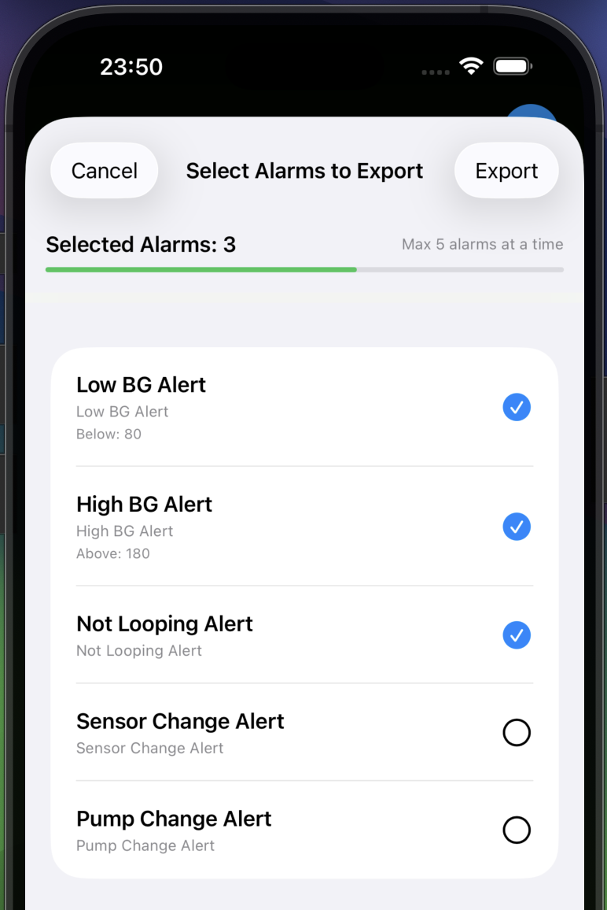{width="300"}
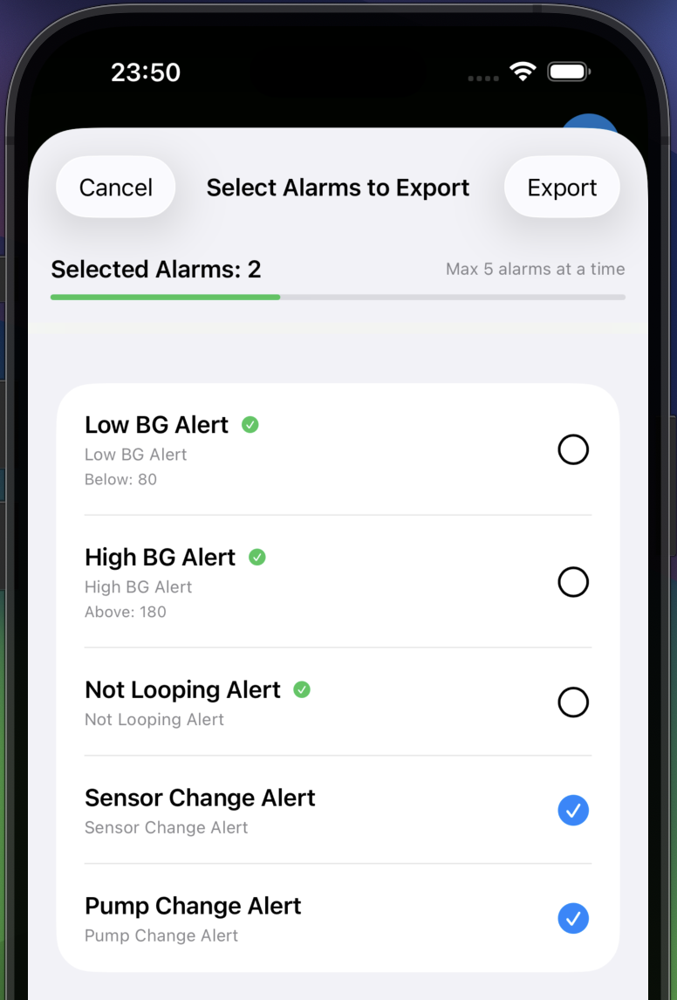{width="300"}
{align="right"}

#### Import Settings

On the phone that will receive the settings from the QR code, choose the option:
"Scan QR Code to Import Settings"

The first time you import settings with LoopFollow, you will be required to give permission to use the camera. Once permission is granted, hold the importing phone to view the QR code presented by the exporting phone. 

When the QR code is accepted, you will see a screen indicating what type of settings is being imported. You will be warned that if you accept the import, your current settings will be overwritten.

> Note the QR code for alarms may be slow to import. Just move the phone closer and further away until the code is accepted.

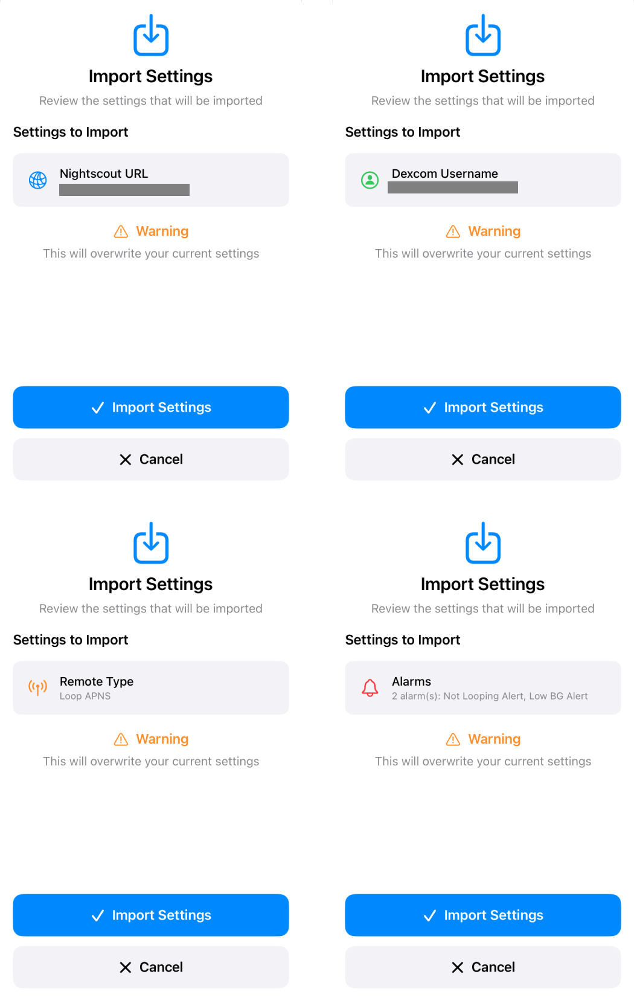{width="600"}
{align=center}

### APN

You must create and enter Apple Push Notification (APN) credentials if you want to make use of several features offered by *LoopFollow*. If you choose not to use these features, no credentials are required.

Features which need APN:

* Live Activity
* Remote Control

Details about creating APN credentials are found in the [Remote Control Overview](../remote/remote-control-overview.md#apple-push-notifications-system-apns){: target="_blank" }

### Live Activity

The Live Activity feature for *LoopFollow* has the following requirements or it will not update reliably and should not be used.

* **APN Credentials** must be entered
* **Background Refresh** must be enabled
    * Typically caregivers use Silent Tunes to keep the app alive in the background
    * If background refresh is not working, the app notifies the user and they should assume Live Activity is also not refreshing
* **Live Activity** must be enabled

#### Live Activity Options

The Live Activity screen allows the following selections:

* Enable Live Activity (slider)
* Restart Live Activity (manual button if needed)
* Grid Slots for Live Activity
    * There are 4 slots available, plus 1 additional slot for the small widget (CarPlay / Watch Smart Stack)
    * The options are the same as are found in the [Information Display](#information-display)
    * Each option can only appear in one slot at a time
    * The default slots are: IOB (top left), COB (bottom left), Projected BG (top right), Empty (bottom right)

The following options are available for each grid slot:

| Option | Description |
|:--|:--|
| Empty | Leave the slot blank |
| Delta | Change in glucose since previous reading |
| Projected BG | Projected glucose value |
| Min/Max | Minimum and maximum values from the current OS-AID forecast |
| IOB | Insulin on Board |
| COB | Carbs on Board |
| Rec. Bolus | Recommended bolus from last loop |
| Autosens | Autosens value (*Trio* only) |
| TDD | Total Daily Dose in the last 24 hours (*Trio* only) |
| Basal | Current basal rate |
| Pump | Reservoir level |
| Pump Battery | Pump battery level |
| Battery | Phone battery level |
| Target | Correction range used by OS-AID |
| ISF | Insulin Sensitivity Factor |
| CR | Carbohydrate Ratio |
| SAGE | Sensor Age |
| CAGE | Cannula Age |
| IAGE | Insulin Age |
| Carbs today | Total grams of carbs since midnight |
| Override | Active override information |
| Profile | Named profile |

### Remote

Detailed instructions for configuring a phone for remote control are found on the [Remote Control Overview](../remote/remote-control-overview.md){: target="_blank" } page.

If you are configuring a second device and already have one device configured for remote control, be sure to review:

* [Export Remote Settings with QR Code](../remote/remote-control-overview.md#export-remote-settings-with-qr-code){: target="_blank" }
* [Import from QR Code](../remote/remote-control-overview.md#import-from-qr-code){: target="_blank" }

### Alarms

The Alarms settings allow you to control the behavior of all active alarms. Individual alarms are selected and configured with the [Alarms Feature](lf-features.md#alarms).

* One nice feature you may want to enable is the Volume Buttons Snooze Alarms option.

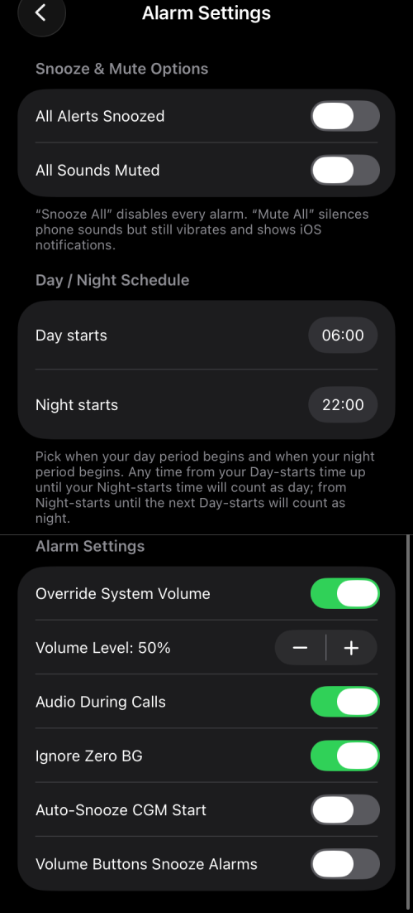{width="350"}
{align="center"}

### Calendar

The calendar entry used to update on the watch in real time, but with iOS 18, the update rate has been throttled. 
It is still useful for Carplay.

### Contact

The Contact image trick added with v2.2.8 currently works to provide real-time updates on an Apple Watch.

For more detailed instructions, see [Real-Time Watch Updates using Contact](lf-features.md#real-time-watch-updates-using-contact){: target="_blank" }

- - -

### Advanced Settings

A number of different options can be adjusted in this screen.

| Advanced Setting | Default | Description |
|:--|:-:|:--|
| Download Treatments | enabled | Treatments from Nightscout, if available, are downloaded and displayed |
| Download Prediction | enabled | Predictions (forecast), if available, are downloaded and displayed |
| Graph Basal | enabled | Actual Basal Rates, if available, are downloaded and displayed |
| Graph Bolus | enabled | Manual and Automatic Bolus values, if available, are downloaded and displayed |
| Graph Carbs | enabled | Meal Entries, if available, are downloaded and displayed |
| Graph Other Treatments | enabled | Treatment notes, if available, are downloaded and displayed |
| BG Update Delay | 10 sec | how many seconds *LoopFollow* waits before it fetches it from your data source See [Update Delay Explained](#update-delay-explained)|
| Debug Log Level | enabled | Allows you to enable or disable debug logging See [Debug Log Level](#debug-log-level) |

#### Update Delay Explained

The Update Delay is how many seconds *LoopFollow* waits, after a new reading is expected (about every 5 minutes), before it fetches it from your data source. *LoopFollow* is a follower, so a reading must first reach your source (*Nightscout* / *Dexcom Share*) before it can be pulled — this short buffer gives the value time to land before *LoopFollow* polls. The default is **10 seconds**, and the range is 1–30 seconds.

* Lowering it does not reliably make updates faster. If *LoopFollow* polls before the new value has arrived, it just re-reads the previous value and retries a few seconds later, which mainly adds extra polls (battery and network) without helping.
* When *Nightscout* is your source with [WebSocket](#websocket) enabled and the app in the foreground, new values are pushed to *LoopFollow* as soon as they arrive, so this delay is not applied. It only affects background polling.

#### Debug Log Level

The debug log option is enabled by default so that detailed information is available if you need to ask for help. The setting is found in the Advanced section and can be turned off if the logs seem too verbose.

- - -

## Logging

### View Log

LoopFollow logs activity to a file that can be viewed within the app, and can be shared if needed. Example ways to share are email, a Notes file or Facebook messenger.  The log can be filtered and searched. This will aid in troubleshooting and diagnostics. 

When you select View Log, you see the entire log but can also filter for particular types of activities.

If you want to modify whether Debug Log Level is enabled, go to [Settings, Advanced](#advanced-settings). But please read [Debug Log Level](#debug-log-level) before disabling this option.

### Share Logs

When you choose Share Logs, *LoopFollow* first asks you to describe the problem — what time it happened, what you did, and what you expected to happen that didn't. A short description makes it much easier for someone to help.

After you tap **Share**, the description is saved to a small notice file (with the current date, app version, and build identifier) and the iOS share sheet opens with that file together with today's and yesterday's log files. You can then send everything to the device or app of your choice. Leaving the description empty is allowed; the notice file simply records that no description was provided.

The log files are named `LoopFollow YYYY-MM-DD`.

- - -

## Build Information

This section reports the `Version` you are using, indicates the `Latest Version`. In addition, it reports when this app will expire, when it was built and provides details of the branch name and commit identifier.

