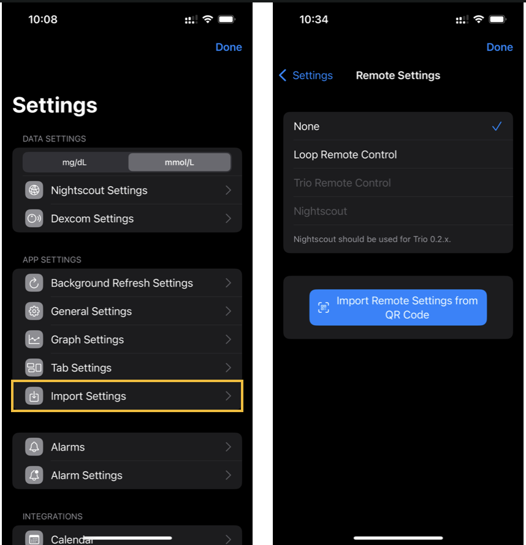
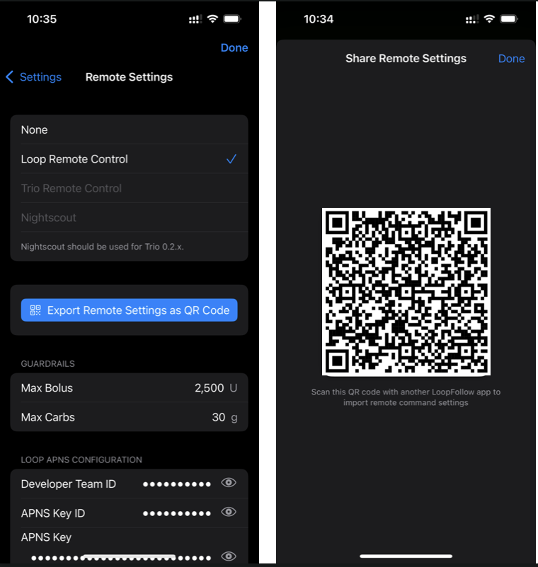
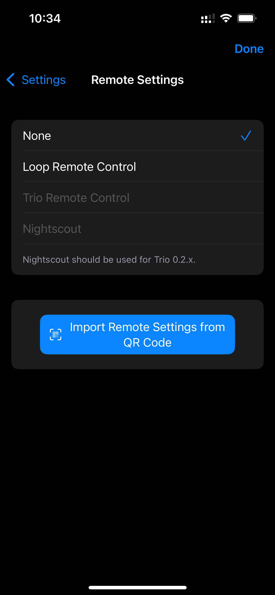

🚧 Documentation Under Construction 🚧

<!--todo-->
<!--Notes: be sure to add this info

-->

## Initial Configuration

After you build *LoopFollow* the first time, you are asked a few questions (your initial choices can always be modified later):

* **Calendar Access**: if you want to allow *LoopFollow* to provide real-time updates to carplay using the Calendar, choose **Allow Full Access**
* **Bluetooth Access**: if you want to use an expired Dexcom sensor or a spare RileyLink device to keep *LoopFollow* running in the background while your phone is locked, choose **Allow**
* **Notifications**: if you want *LoopFollow* to notify you for any of your alarms or if *LoopFollow* stops working, choose **Allow**

You will then be presented with a blank home screen as shown below.

> {width="300"}
{align="center"}

### Navigate to Settings

Tap on the Gear/Settings Icon (⚙️) in the tab bar to get to the Settings screen.

!!! note "Tab Customization"
    With version 3.1 and newer, you can modify what icons show up in the tab bar. 
    
    If the far right icons is the &hellip;&nbsp;More icon, first tap on that and then choose Settings to get to the Settings screen.

- - -

!!! note "Setting up a second device"
    With version 4.0 and newer, You can set up a second device by scanning a QR code from another LoopFollow user. See this section [QR Code Setup](#qr-code-setup).

- - -

### Settings Screen

The full lists of Settings is shown in the composite graphic below.

* The `Information Display Settings` and `Remote Settings` rows are only available with [Nightscout Credentials](#add-nightscout).

> {width="700"}
{align="center"}

### *LoopFollow* Data Source

> Make sure you have access to the internet when filling out credentials.

You provide *LoopFollow* with information about the person you are following. At least one of these must be entered:

* [*Nightscout* URL](#add-nightscout)
* [*Dexcom* Share credentials](#add-dexcom)

#### Add *Nightscout*

The graphic below shows the display when you tap on the *Nightscout* Settings row. For more information about tokens, keep reading the details below the graphic.

To simplify setup, you can copy your *Nightscout* URL (including the token) from the [Admin Tools in *Nightscout*](https://nightscout.github.io/nightscout/admin_tools/#subjects-and-roles). When pasted into *LoopFollow* URL row, the app will automatically extract and fill in both the URL and token.

{width="300"}
{align="center"}

!!! tip "*Nightscout* Access"
    It is possible to have your *Nightscout* site readable by the world, in which case you do not need to add a token. If you choose to do that, just ignore references to entering the token. The status will show up as `OK (Read)`.

    The only exception is if you choose to use *LoopFollow* [*Nightscout* Remote Control](../remote/remote-control-nightscout.md){: target="_blank" }. In that case, you must have a token with careportal access.

    For more information about tokens with *Nightscout*, refer to [Admin Tools in *Nightscout*](https://nightscout.github.io/nightscout/admin_tools/#subjects-and-roles).

The type of token depends on the type of remote control desired. 
The table below indicates the minimum token access for each type of remote control available with *LoopFollow*. 
When you enter your credentials, *LoopFollow* tries to reach the site and then provides the status. 

* The *Loop* Remote Control option requires *LoopFollow* version 3.2 or newer
* The *Trio* Remote Control option requires the user be on version 0.5.x or newer of Trio
    * **Breaking change** on 2025-October-06
    * *Trio* 0.6 or newer requires *LoopFollow* 4.0 or newer
    * *Trio* 0.5.1.28 or older requires *LoopFollow* 3.2.11 or older

| *LoopFollow* Remote Type | Minimum Token Access| *LoopFollow* Status |
|:--|:--|:--|
| **None** | Read | OK (Read) |
| ***Nightscout*** | Read & Careportal | OK (Read & Write) |
| ***Loop* Remote Control**| Read | OK (Read) |
| ***Trio* Remote Control**| Read | OK (Read) |

#### Add *Dexcom*

The graphic below shows the display when you tap on the *Dexcom* Settings row.

> The *Dexcom* Share credentials are optional, but can be useful when the *Nightscout* URL is unavailable.

{width="300"}
{align="center"}

- - -

## The Toolbar

The toolbar (tab bar) at the bottom of the screen is now configurable for rapid access to the items of your choice. The items that can be selected are:

* [Home](#home)
* [Alarms](#alarms)
* Snoozer
* [Remote](#remote-settings)
* Nightscout
* Settings

See [Toolbar Tab Customization](lf-features.md#toolbar-tab-customization){: target="_blank" }

- - -

## Home

The home screen provides a dashboard of important information.  

* Supports Glucose display when Dexcom is available but Nightscout is not
* Supports Information Display from *Loop* and *Trio* when Nightscout URL is provided
    * *Loop* & *Trio*: common features like status, basal, bolus, carbs and eventual glucose forecast
    * *Loop*: *Loop* specific features like Profile Name, remote control (in development)
    * *Trio*: *Trio* specific features like Autosens, TDD, remote control (with *Trio* 0.5.x and newer)

Once you’ve configured your settings, your Main screen will look as beautiful as the example below!

{width="700"}
{align="center"}

- - -

## App Settings

🚧 Documentation Under Construction 🚧

#### QR code setup

When setting up LoopFollow for another caregiver that will use the same nightscout and remote control capabilities, you can scan a QR code from the other phone to get the settings for Nightscout URL, Token and all remote settings.

If you already setup nightscout and want to share the remote commands capabilites, read this section [QR Code Remote Setup](#qr-code-remote-setup)

When you enter Settings with an app that does not have any nightscout adress set, there will be a button in settings named Import Settings.

{width="300"}
{align="center"}

Clicking that will take you to the remote screen where you can use the button Import Remote Settings from QR Code.

Use the Camera to scan a QR Code from the other phone.

This will populate the nightscout address, token and remote settings

To show the QR Code, you can go into Remote settings and click the button Export Remote Settings as QR Code and the QR code will show on screen

{width="300"}
{align="center"}

!!! warning "QR Code contain secret information"
    Never share your QR code as a screenshot online or send it to someone that is not supposed to have access to remote capabilities for your looper. If in doubt revoke access to the key at [https://developer.apple.com/account/resources/authkeys/list](https://developer.apple.com/account/resources/authkeys/list)

### Background Refresh Settings

🚧 Documentation Under Construction 🚧

### General Settings

🚧 Documentation Under Construction 🚧

### Graph Settings Settings

🚧 Documentation Under Construction 🚧

### Tab Settings

The user can modify which icons are displayed in the task bar at the bottom of the screen.

See [Toolbar Tab Settings](lf-features.md#toolbar-tab-customization){: target="_blank" } for more information.

### Information Display Settings

🚧 Documentation Under Construction 🚧

#### `Rec. Bolus`

!!! warning "LoopFollow Report of Trio Recommended Dose"
    It happens. We made a mistake. The `Rec. Bolus` feature for *LoopFollow* was reporting a value from the *Trio* app that was never meant to be used as a recommended bolus. 
    
    * With `LoopFollow` 4.0 and newer, users viewing a *Trio* URL will notice the `Rec. Bolus` display is always blank
        * Updates are planned for *Trio* and *LoopFollow* to provide the last recommended value from the *Trio* app
    * The value shown to users viewing a *Loop* URL matches what the user of the *Loop* phone would see when asking for a recommendation and is not changed in `LoopFollow` 4.0
    
    **Remember: the `Rec. Bolus` values is from the last AID app update to Nightscout**
    

### Remote Settings

🚧 Documentation Under Construction 🚧

#### QR code remote setup

To get the remote settings from another phone, Go into Settings->Remote settings. Use the button Import Remote Settings from QR Code.

{width="300"}
{align="center"}

If the button does not show and there is a button called Export Remote Settings as QR code, you may have already setup remote commands. If you want to overwrite those settings select None at the top remote command selector

Use the Camera to scan a QR Code from the other phone.

To show the QR Code, go into Remote settings and click the button Export Remote Settings as QR Code and the QR code will show on screen

{width="300"}
{align="center"}

!!! warning "QR Code contain secret information"
    Never share your QR code as a screenshot online or send it to someone that is not supposed to have access to remote capabilities for your looper. If in doubt revoke access to the key at [https://developer.apple.com/account/resources/authkeys/list](https://developer.apple.com/account/resources/authkeys/list)

### Alarms

🚧 Documentation Under Construction 🚧

### Alarm Settings

🚧 Documentation Under Construction 🚧

- - -

## Integrations

🚧 Documentation Under Construction 🚧

### Calendar

The calendar entry used to update on the watch in real time, but with iOS 18, the update rate has been throttled. 
It is still useful for Carplay.

### Contact

The Contact image trick added with v2.2.8 currently works to provide real-time updates on an Apple Watch.

For more detailed instructions, see [Real-Time Watch Updates using Contact](../)

- - -

## Advanced Settings

🚧 Documentation Under Construction 🚧

Allows you to choose what information to download from Nightscout and to*  modify your graph

* Download Treatments
* Download Prediction
* Graph Basal
* Graph Bolus
* Graph Carbs
* Graph Other Treatments
* BG Update Delay
* Logging options (turn on debug option)

- - -

## Logging

LoopFollow logs activity to a file that can be viewed within the app, and can be shared via email, a Notes file or Facebook messenger if needed.  The log can be filtered and searched. This will aid in troubleshooting and diagnostics. 
Normally, the debug log option is disabled. The log debug option is found in the Advanced Settings section. If the logs seem verbose, check that setting.

### View Log

🚧 Documentation Under Construction 🚧

### Share Logs

🚧 Documentation Under Construction 🚧

- - -

## *LoopFollow* Facebook Group

Tapping on this row takes you to the *LoopFollow* Facebook Group where you can review posts and ask for assistance.

- - -

## Build Information

This section reports the `Version` you are using, indicates the `Latest Version`. In addition, it reports when this app will expire, when it was build and provides details of the branch name and commit identifier.

